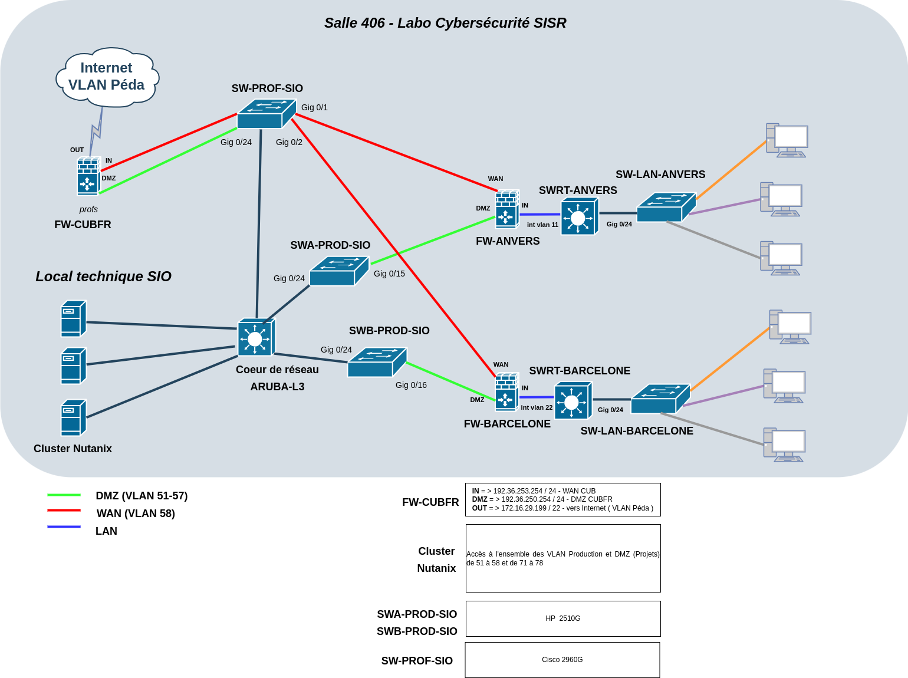

# Schémas réseaux de l'entreprise CUB

L'entreprise CUB dispose d'une infrastructure complexe avec un site central et différentes agences interconnectées. De plus, cette infrastructure est transposée dans le laboratoire SISR 2 du BTS SIO. Ainsi, il est indispensable de disposer de ces informations afin d'avoir une vue complète et précise de l'architecture.

## Schéma réseau physique

## Schéma réseau logique

