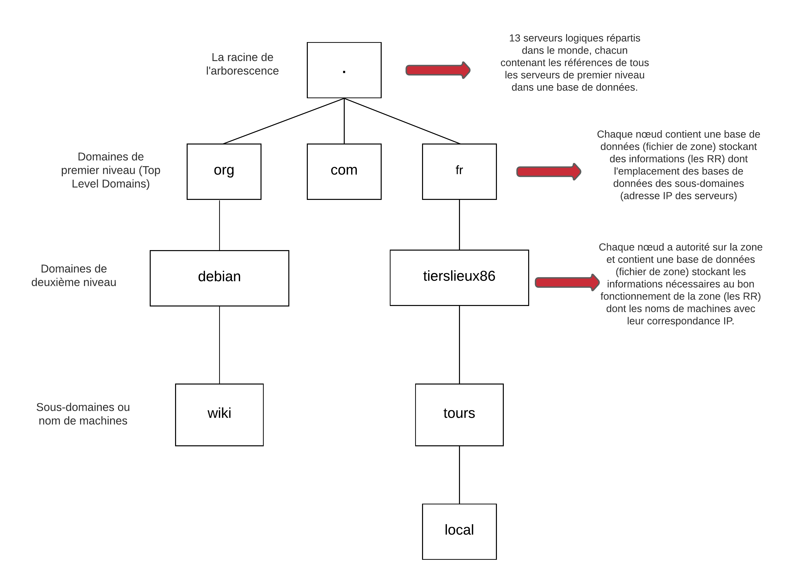

# Introduction

## 1. Préambule

!!! Warning  "Attention"
    Ces annexes ont pour objectif de vous fournir l’aide nécessaire à la réalisation des activités confiées. Vous trouverez des exemples de configuration que vous devrez recontextualiser vis-à-vis de l’environnement qui est le vôtre.

!!! Danger "Vigilance"
    Une attention toute particulière doit être apportée à la rigueur syntaxique utilisée afin d’obtenir un service DNS fonctionnel.

DNS est une des pierres angulaires du réseau Internet et des réseaux locaux. Ce service est sollicité dans de très nombreux cas. Il est aussi important que les protocoles Ethernet, IPv4, IPv6 et TCP/UDP. Sans lui, des outils comme la messagerie ne peuvent fonctionner correctement. Vous devez ainsi maitriser les fondamentaux à ce sujet tant d'un point de vue technique que théorique.

## 2. Arborescence DNS mise en oeuvre dans cette documentation

