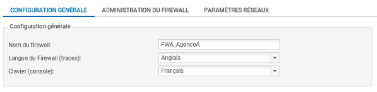
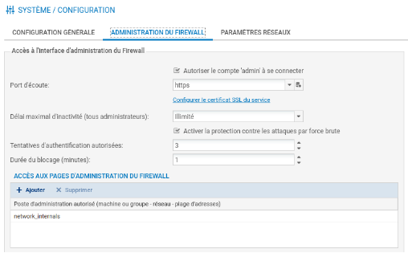
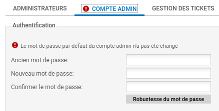
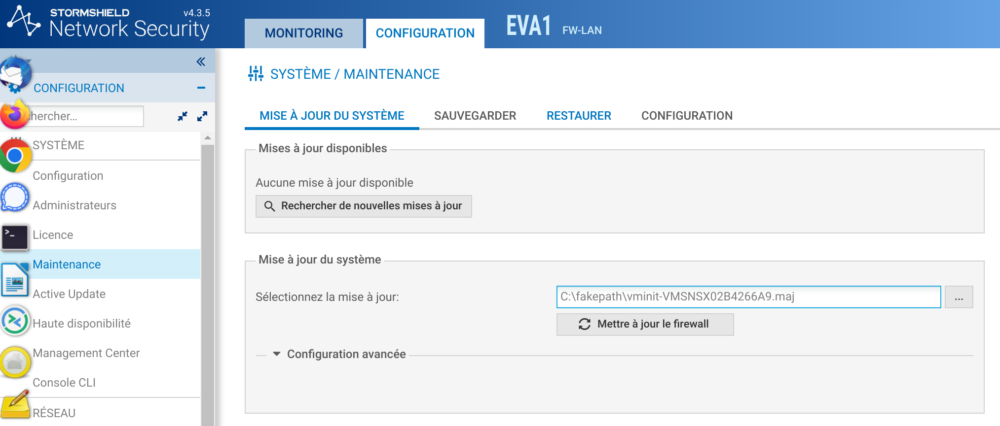
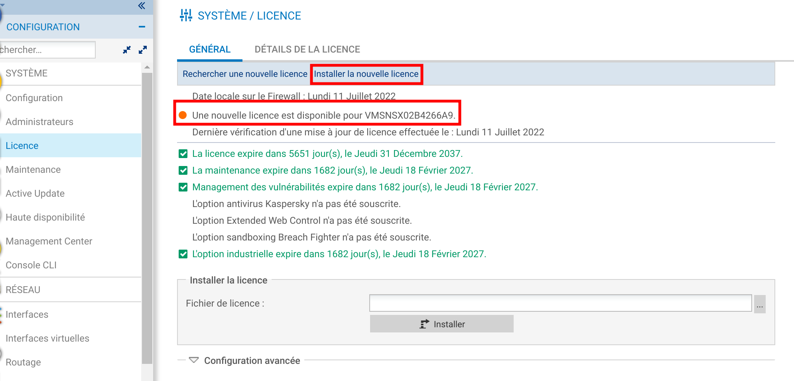
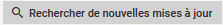

# Fiche 02 -- Prise en main d'un Pare-feu SNS

!!! info "Documentation officielle"
    <https://documentation.stormshield.eu/SNS/v4/fr/Content/User_Configuration_Manual_SNS_v4/Welcome/WELCOME.htm>

## Connexion au pare-feu SNS

Pour accéder à l'interface d'administration du pare-feu SNS, il est
indispensable de connecter votre machine cliente (physique ou virtuelle)
sur une interface interne (**IN** ou **DMZ1 ou 2** sur les boîtiers
SN310 et les machines virtuelles, **IN** sur les boitiers SN210) sous
peine de devoir redémarrer le pare-feu qui aura détecté une tentative
d'usurpation d'adresse IP sur le bridge et bloquera tout le trafic
généré par la machine connectée sur l'interface **OUT**.

L'interface **IN** doit être dans le même réseau que la machine à partir
de laquelle il va être procédé à une première configuration.

L'accès à l'interface graphique d'administration du pare-feu SNS se fait
par https://@IP/admin (https://10.0.0.254/admin sur un boîtier) à partir
d'un navigateur web :

| L'écran ci-contre apparaît pour vous connecter une fois le pare-feu SNS démarré.  |
|----------------------------------------------------------------------------------------------------------------------------------------------|--------------------------------------------------------------------------------------------------------------------|
| - Pour modifier les options de langue de l'interface web d'administration, dépliez **Options** puis choisissez la langue.                     | La fenêtre est actualisée, vous pouvez vous connecter à nouveau.                                                    |
| - Saisir l'identifiant **admin**, le mot de passe **admin** ou celui que vous avez configuré si vous avez effectué la réinitialisation de la machine virtuelle (par ex. **Sio2022\*** ou autre). | **Remarque :** pour s'authentifier, l'utilisateur peut également sélectionner un certificat SSL dans le magasin de son navigateur (à configurer au préalable dans les préférences du pare-feu SNS). Nous étudierons cette possibilité dans la partie avancée sur la mise en place d'une PKI avec Stormshield. |

!!! Danger  "Sécurité"
    Pour des raisons évidentes de sécurité, il conviendra de modifier ce mot de passe lorsque le pare-feu SNS sera utilisé en contexte réel d'entreprise.

La page d'accueil de votre pare-feu SNS s'ouvre sur un **Tableau de
bord** qui permet de visualiser un certain nombre d'informations sur
votre équipement et est personnalisable.

## Première configuration

Nous verrons ci-après un certain nombre d'éléments de configuration
générale utiles pour la bonne mise en œuvre de votre pare-feu SNS (pour
des configurations plus avancées et autres détails, cf fichier
v4CSNA_v4_Livre_formation_Stomshield.pdf).

!!! Warning  "Vigilence"
    Afin de ne jamais être déconnecté en cas d'inactivité sur l'interface d'administration pendant ces exercices pratiques, il
    conviendra de modifier vos préférences, **en usage réel vous utiliserez un délai de 5 minutes pour éviter de laisser votre session ouverte sur
    le pare-feu SNS.**

-   Cliquer sur la flèche à droite de l'icône représentant l'utilisateur
    connecté
     en haut à droite.
-   Cliquer sur l'icône
    **Préférences** 
-   Dans la zone **Paramètres de connexion**, sélectionner dans la liste
    « Déconnexion en cas d'inactivité : » la valeur **Toujours rester connecté**.

Nous étudierons notamment les éléments du menu **Configuration / Système
**qui correspond à la configuration générale : licence, mise à jour, mot
de passe, etc.

## Configuration générale

-   Sélectionner dans le menu à gauche **Configuration / Système **puis
    **Configuration**. Le volet **Configuration générale** est affiché.
-   Commencer par donner un **nom** à votre boîtier et **changer la langue **de la console.

Il est préférable de mettre les logs en anglais : *Langue du pare-feu
(traces)* afin de pouvoir rechercher plus facilement des références à
d'éventuels problèmes dans les ressources documentaires Stormshield et
sur les forums avec les bons mots-clés.

La zone **Politique de mots de passe** permet de définir la longueur du
mot de passe (8 par défaut) et la zone **Types de caractères
obligatoires** permet de gérer la complexité du mot de passe (Aucun,
Alphanumériques, Alphabétiques et spéciaux), la zone **Entropie
minimale** correspond à la robustesse du mot de passe. **En utilisation
en entreprise, il est recommandé de changer le mot de passe de
l'administrateur et d'augmenter à 12 le nombre de caractères.**

La zone « **Paramètres de date** **et d'heure » **permet de modifier le
fuseau horaire dans la zone **Fuseau horaire**, sélectionnez **Europe/Paris**.

!!! Info  "NB"
    La modification du fuseau horaire implique un redémarrage immédiat, pour ne pas avoir de décalage dans les journaux ou avec une PKI*.

-   Cliquer le bouton **Appliquer** pour sauvegarder la configuration et **Sauvegarder**

Un avertissement puis une icône
 apparaissent vous invitant à redémarrer le pare-feu.
*Il est bien sûr possible de le faire une fois les autres configurations réalisées.*

-   Cliquer sur l'icône et sélectionner **Redémarrer maintenant**.

-   Après le redémarrage (au bout d'environ 3 minutes), revenir au menu
    **Configuration / Système **puis **Configuration** et dans la zone
    **Paramètres de date et d'heure **cliquer sur **Maintenir le
    pare-feu à l'heure (NTP) **pour que les mises à jour d'heure
    d'été/heure d'hiver soient également effectives.

### Administration du pare-feu

-   Dans le volet **Système / Configuration**, ouvrir l'onglet
    **Administration du pare-feu** pour visualiser les options de
    configuration de l'administration du pare-feu.

Plusieurs options sont configurables mais ne sont pas détaillées ici
(cf. fichier CSNA_v4_Livre_formation_Stomshield.pdf).

### Paramètres réseaux

-   Dans le volet **Système / Configuration**, ouvrir l'onglet
    **Paramètres réseaux** pour visualiser les options de configuration
    réseau du pare-feu.

Les pare-feu Stormshield Network supportent le protocole IPv6 et
plusieurs fonctionnalités (interface, routage, filtrage, VPN et
administration) sont compatibles IPv6. Cependant, ce support est
optionnel et son activation s'effectue via le bouton **Activer le
support du protocole IPv6 sur ce pare-feu (ce qui est inutile ici)**.

!!! Info  "NOTE"
    Cette action étant irréversible, la sauvegarde de la
    configuration du pare-feu vous sera proposée automatiquement lorsque
    vous cliquerez sur ce bouton. Le retour à un support IPv4 exclusif (sans
    IPv6) n'est possible qu'après une remise à la configuration usine
    (reset) du pare-feu.

Dans le cas où le pare-feu transite par un proxy pour accéder à
Internet, les paramètres se renseignent depuis ce menu.

Un ou plusieurs serveurs DNS peuvent être ajoutés. Le pare-feu contacte
ces serveurs pour toute résolution qu'il émet ou doit relayer. Ces
résolutions de noms sont nécessaires pour des fonctionnalités telles que
Active Update qui interroge les serveurs de mise à jour pour télécharger
les bases de données (signatures contextuelles, antivirus, Vulnerability
Manager, etc.).

Pour ajouter un DNS :

-   Cliquer sur **Ajouter** puis saisir (ou choisir ou créer) un
    « objet » (cf fiche 4) et cliquer sur le bouton **Appliquer** pour
    sauvegarder la configuration et **Sauvegarder**.

!!! Info  "NOTE"
    Ci-dessous, les trois DNS par défaut (la machine elle-même, et deux DNS
    de Google !). Si on passe la souris sur l'objet, on voit les valeurs des
    propriétés de l'objet.

### Autres configurations

#### Modification du mot de passe de l'administrateur

La **modification du mot de passe admin **(recommandée) se fait dans le
menu **Configuration/Système/Administrateurs puis **onglet **Compte
ADMIN. **Le mot de passe doit par défaut, comporter au moins **8**
**caractères **et doit respecter la politique de mot de passe définie
dans le menu **Configuration**. La robustesse du mot de passe choisit
s'affiche alors. Elle indique son niveau de sécurité : Très faible,
faible, moyen, bon, excellent. Il est fortement conseillé d'utiliser les
majuscules et les caractères spéciaux pour augmenter le niveau de
sécurité.

#### Activation de la licence

Le menu **Configuration / Système / Licence** affiche les détails de la
licence et permet le cas échéant de l'installer :

-   **pour un boîtier** : à récupérer par l'administrateur sur le site
    *mystormshield.eu* avec les informations figurant sous le boîtier.
-   **Pour une VM** : il est nécessaire au préalable de procéder à
    l'activation du kit à télécharger sur le site de Stormshield (voir
    également page suivante) :
    https://documentation.stormshield.eu/SNS/v4/fr/Content/PDF/InstallationGuides/sns-fr_EVA_Guide_Installation.pdf

!!! Warning  "Attention"
    À noter que si vous n'activez pas la licence au bout d'un certain temps
    les fonctionnalités se réduisent et surtout vous ne pourrez pas stocker
    les logs sur les boîtiers physiques.

Sur une VM, les fonctionnalités sans activation sont limitées :

-   **Pour activer la licence sur une VM :**

-   Se connecter sur
    [https://mystormshield.eu](https://mystormshield.eu/).
-   Cliquer sur « Product management » (menu gauche) et télécharger le
    kit d'activation.
-   Revenir éventuellement sur la page pour télécharger le fichier
    licence, mais cette dernière pourra être activée automatiquement une
    fois le kit d'activation intégré via l'interface du pare-feu.

!!! Warning  "Attention"
    

Il est nécessaire d'importer d'abord le fichier de mise à jour
téléchargé via le kit d'activation.

-   Activer le menu Configuration / Système / Maintenance.
-   L'onglet sur « Mise à jour du système » est activé. Cliquer le
    bouton « ... » et sélectionner la mise à jour récupérée dans le kit
    d'activation à partir d'un poste client ou d'une clé USB.

Depuis la zone **Configuration avancée,** vous pouvez choisir de
**Télécharger le firmware** **et l'activer** ce qui appliquera la mise à
jour ou bien de la télécharger uniquement, son activation pourra se
faire ultérieurement avec l'option **Activer le firmware**
**précédemment téléchargé**.

-   Dans la zone **Configuration avancée **choisir **Télécharger le
    firmware** **et l'activer.**
-   Cliquer sur le
    bouton 
L'opération prendra plusieurs minutes surtout ne débranchez pas le
pare-feu pendant la mise à jour. Le pare-feu sera ensuite redémarré.

-   Une fois cette opération réalisée, activer le menu Configuration /
    Système / Licence puis cliquer sur « Installer la nouvelle
    licence ». Cette dernière s'active alors automatiquement.

#### Mise à jour du système

Le menu **Configuration / Système / Maintenance / **onglet **Mise à jour
du système** permet de mettre à jour le système le cas échéant. Afin
d'appliquer un fichier de mise à jour du firmware, vous devrez le
télécharger sur le pare-feu (soit directement via le lien
 une fois que la configuration du réseau et de la
passerelle par défaut est réalisée et que le pare-feu a accès à
Internet, soit en allant le télécharger sur le site
[*https://mystormshield.eu*](https://mystormshield.eu/)).

!!! Warning  "Attention"
    Pour que la mise à jour puisse se faire, la date et l'heure doivent être synchronisé via le protocole NTP.roduct management » (menu gauche) :

!!! Warning  "Attention"
    Il est parfois nécessaire de réaliser les mises à jour
    intermédiaires à récupérer sur le site de
    [Stormshield](https://mystormshield.eu/) (cela a été le cas sur le
    SNS510 mais non sur les VM) même en dehors de celles qui sont proposées.

-   
-   Cliquer **Configuration **/ **Système /
    Maintenance** / onglet **Mise à jour du système**.
-   Cliquer le bouton « ... » et sélectionner le fichier de mise à jour
    présent sur le poste client ou une clé USB.
-   Déplier la zone **Configuration avancée.**
-   Dans la « configuration avancée », vous pouvez choisir de
    **Télécharger le firmware** **et l'activer** ce qui appliquera la
    mise à jour ou bien de la télécharger uniquement, son activation
    pourra se faire ultérieurement avec l'option **Activer le firmware**
    **précédemment téléchargé**.
-   Dans la zone **Configuration avancée **choisir **Télécharger le
    firmware** **et l'activer.**
-   Cliquer sur le
    bouton 

L'opération prendra plusieurs minutes surtout ne débranchez pas le
pare-feu pendant la mise à jour. Le pare-feu sera ensuite redémarré.

!!! Warning  "Attention"
    

Recharger la page si cette fenêtre boucle indéfiniment.

Le menu **Configuration / Système / Maintenance / **onglet
**Configuration** permet **uniquement sur les boîtiers physiques** de
déterminer la partition active et ainsi de garder deux versions du
système disponibles avec une partition de sauvegarde qui permet de
revenir en arrière sur le boitier (firmware n-1, config n-1).

*NB : Pour revenir à une configuration ou version n-2 ou supérieure il
faut utiliser USB Recovery* *accessible seulement sur mystormshield.eu
avec un compte client.*

Le menu **Configuration / Système** **/ Active update** permet de
contrôler la mise à jour automatique des modules de Bases d'URLs
embarquées, IPS : signatures de protection contextuelles,
Géolocalisation / Réputation IP publiques, signatures antispam,
antivirus et autres listes noires préconfigurées par Stormshield. Il est
conseillé d'activer uniquement celles qui vous sont utiles.

#### Sauvegarde et restauration de la configuration

La **sauvegarde de la configuration** se fait dans le menu
**Configuration / Système** **/ Maintenance** **/ onglet Sauvegarder**.

-   Au besoin, modifier le nom du fichier et cliquez sur le bouton pour
    le télécharger. La sauvegarde automatique du fichier de
    configuration peut être mise en place et effectuée sur le Cloud
    Stormshield.

!!! Info  "Info"
    le fichier de configuration est un fichier texte chiffré (extension « **na** »).

La **restauration d'une configuration** s'effectue dans le menu
**Configuration / Système** **/ Maintenance** **/ **onglet
**Restaurer**.

-   Sélectionner le fichier à restaurer en cliquant sur le bouton **...**
