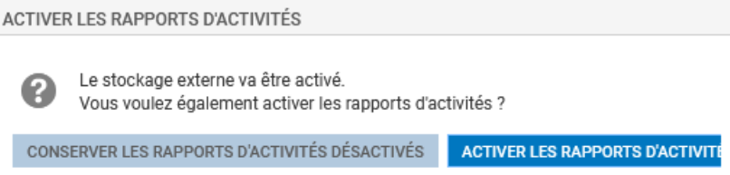
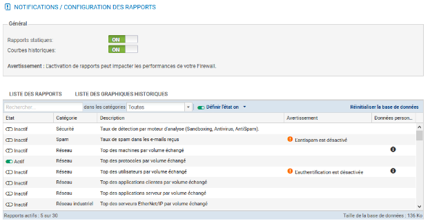
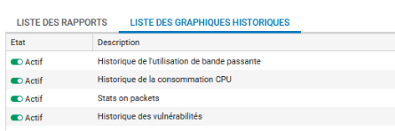
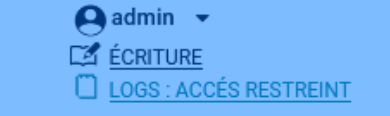
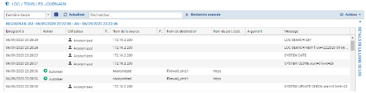

# Fiche 03 -- Traces, Journaux et supervision

Le stockage des journaux (logs) des pare-feu Stormshield peut être
configuré soit en local, soit vers un serveur Syslog, soit avec le
protocole IPFIX. Les journaux, rapports d'activités et graphiques
d'historiques sont disponibles sur les pare-feus ne disposant pas de
stockage local des journaux. Cependant, ils sont limités à 5 rapports et
graphiques au total avec un historique maximal de 7 jours.

## Configuration du stockage des journaux (logs)

Le stockage en local n'est activé par défaut que sur les machines
virtuelles, il faut donc le cas échéant le configurer.

-   Sélectionner dans le menu à gauche **Configuration / Notifications /
    Traces -- Syslog - IPFIX** puis dans l'onglet **/ Traces -- Syslog
    -- IPFIX** choisir **Stockage local**. 

Sur **une machine virtuelle**, celui-ci est activé par défaut et occupe
un **espace disque de 6Go** :

**Sur un boîtier physique,** le stockage local des logs n'est pas activé
par défaut.

-   Insérer une carte SD dans l'emplacement en façade du pare-feu SNS,
    lorsque le pare-feu est éteint, elle sera automatiquement détectée
    lors du démarrage (*sauf si vous n'avez pas installé la licence*) et
    le système vous proposera de la formater avant utilisation.

La zone **Support de stockage** permet de sélectionner le support de
stockage local « disque dur interne » ou « carte mémoire SD ». Au
besoin :

-   cocher le bouton
    **ON ;**
-   dans la zone **Support de stockage** sélectionner dans la liste
    **Périphérique** la carte SD comme support de stockage.

Le système vous propose de la formater avant utilisation.

-   Cliquer **Formater Carte SD**. Cette opération prend quelques secondes.

!!! Warning  "Attention"
    Afin de stocker les journaux du pare-feu SNS sur un support externe
    (carte SD) vous devez d'abord enregistrer la licence, le message
    d'erreur qui apparaît alors n'est pas explicite, le système fait comme
    s'il ne pouvait détecter la carte SD.

Une fois le support formaté, la liste des journaux pré-configurés est
activée avec pour chaque journal un espace dédié. Vous pouvez désactiver
certains journaux si vous le souhaitez.

-   Le cas échéant, cliquer **Appliquer** puis **Sauvegarder** pour
    activer le stockage local des journaux.

-   Le cas échéant, cliquer **Conserver les rapports d'activité
    désactivés.**

La zone **Configuration de l'espace réservé pour les traces** permet
d'activer ou non l'écriture des traces pour une famille donnée en
double-cliquant dans la colonne **État** correspondante. Elle permet
également de configurer le pourcentage de l'espace disque réservé pour
la famille de trace dans la partie **Pourcentage**. Il est important de
noter que le total des pourcentages ne doit pas dépasser 100 %. La
taille réelle de l'espace disque réservé à une famille de traces est
indiquée dans la partie **Quota d'espace disque.**

Les entrées de journal anciennes sont écrasées par les nouvelles entrées
(rotation) : il s'agit du comportement par défaut. Pour une
journalisation sans rotation, il faut un stockage externe (serveur
SYSLOG par exemple).

L'activation des rapports s'effectue depuis le menu **Configuration /
Notifications / Configuration des rapports.**

-   Cliquer **Configuration / Notifications / Configuration des
    rapports** et activez l'option **Rapports statiques**, ensuite
    sélectionnez les rapports souhaités dans le panneau **Liste des
    rapports**.

Par défaut le rapport sur le **Top des protocoles** par volume est
activé si vous activez les rapports.

L'onglet **Liste des graphiques historiques** permet de visualiser et
modifier les graphiques activés par défaut.

## Les Journaux

Les fichiers journaux sont organisés en plusieurs catégories dont les
plus importantes sont listées ci-dessous.

-   **Administration :** regroupe les évènements liés à l'administration
    du pare-feu SNS. Ainsi, toutes les modifications de configuration
    effectuées sur le pare-feu sont journalisées.
-   **Authentification :** regroupe les évènements liés à
    l'authentification des utilisateurs sur le pare-feu SNS.
-   **Connexions réseaux : **regroupe les évènements liés aux connexions
    TCP/UDP traversant ou à destination du pare-feu SNS non traitées par
    un plugin applicatif.
-   **Évènements systèmes : **regroupe les évènements liés directement
    au système: arrêt/démarrage du pare-feu SNS, erreurs système,
    allumage/extinction d'une interface, haute disponibilité, mises à
    jour Active Update, etc.
-   **Alarmes :** regroupe les évènements liés aux fonctions de
    prévention d'intrusions (IPS) et les évènements tracés avec le
    niveau alarme mineure ou majeure de la politique de filtrage.
-   **Proxy HTTP :** regroupe les évènements liés aux connexions
    traversant le proxy HTTP.
-   **Connexions applicatives (plugin) :** regroupe les évènements liés
    aux connexions traitées par un plugin applicatif (HTTP, FTP, SIP,
    etc).
-   **Politique de filtrage :** regroupe les évènements liés aux règles
    de filtrages et/ou de NAT, lorsque la journalisation des règles est
    en mode verbeux.

Dans le contexte **Monitoring**, le menu **LOGS - JOURNAUX D'AUDIT**
permet de visualiser les journaux et traces sauvegardés en local sur le
pare-feu SNS, regroupés par famille de journaux : trafic réseau,
alarmes, web, etc.

Exemple : la famille **Trafic réseau **concatène les journaux Connexions
réseaux, filtrage, Proxy FTP, connexions applicatives, Proxy POP3, Proxy
SMTP, Proxy SSL, Proxy HTTP, VPN SSL.

Les traces sont affichées par ordre anti chronologique (la trace la plus
récente est en tête de liste).

!!! Info  "Important"
    Pour appliquer le règlement général sur la protection des données
    (RGPD), l'accès aux logs des pare-feus SNS est restreint par défaut pour
    tous les administrateurs.

Le super administrateur « admin », ainsi que les
administrateurs disposant du droit « Accès aux données personnelles »
peuvent accéder aux logs complets en cliquant simplement sur **Obtenir
le droit d'accès aux données personnelles (logs)**. Cette manipulation
ajoute une entrée dans les journaux qui permet de la tracer.

## Consultation des Journaux

-   Cliquer **Monitoring **puis **LOGS - JOURNAUX D'AUDIT **puis, par
    exemple, **Trafic réseau**.

Pour voir l'ensemble des données relatives à une trace, mettez la ligne
désirée en surbrillance et cliquez sur la flèche en haut à droite
**Détails de la ligne de log**.

L'affichage des journaux peut être restreint à une plage temporelle
prédéfinie (dernière heure, aujourd'hui, hier, semaine dernière ou mois
dernier) ou personnalisée.

En cliquant sur un type de trace, une fenêtre s'affiche pour offrir des
raccourcis vers plusieurs fonctionnalités qui diffèrent suivant le type
de trace affichée : afficher de l'aide, ajouter la machine à la base
objet, filtrer les traces en se basant sur la valeur, voir la ligne
complète de la trace, etc.

Pour **filtrer les traces**, une barre de recherche simple permet de
rechercher une chaîne de caractères dans toutes les colonnes de toutes
les traces, voir l'exemple ci-dessous pour **icmp**.

