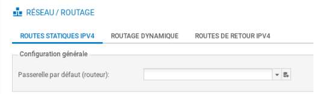
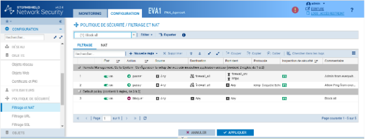
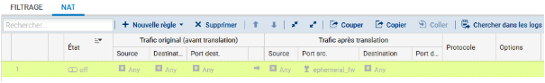
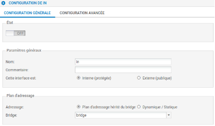

# Fiche 04 -- Configuration du réseau

## Configuration des interfaces réseau

*Dans une configuration usine, la **première interface** du pare-feu SNS
210 est nommée « OUT » (qui correspond à l'interface WAN sur un boitier
physique) et la **seconde** « IN ». Les suivantes (3 à 7) sont des ports
de commutateurs. La dernière interface « DMZ1 » (qui correspond à
l'interface  DMZ  sur un boitier physique 210) sert à connecter le
pare-feu sur une zone démilitarisée. *

L'interface « OUT » est une **interface externe**, utilisée pour
connecter le pare-feu SNS à internet (WAN) et le reste des interfaces
sont internes et servent principalement à connecter le pare-feu SNS à
des réseaux locaux. *La distinction interface interne/externe permet de
se protéger contre les attaques d'usurpation d'adresse IP.*

!!! Warning  "Attention"
    Pour accéder à l'interface d'administration du
    pare-feu SNS, il faut connecter votre machine sur une interface interne
    (in, dmz1, dmz2, etc) **sous peine d'être détecté comme tentative
    d'intrusion qui nécessite le redémarrage du firewall.

!!! Info  "Attention"
    Dans ce cas, on aura un message « forbidden » sur le navigateur,
    on peut déconnecter le câble (faisable aussi en virtuel en désactivant
    la carte), changer son IP et se reconnecter à une autre interface
    interne sans redémarrage.*

La **configuration des interfaces **s'effectue
dans le menu **Configuration / Réseau / Interfaces**, en faisant
« sortir » les interfaces Ethernet de l'interface bridge créée par
défaut sur le boîtier.

-   Sélectionner **Configuration / Réseau / Interfaces**.

Configuration par défaut avec bridge
  
   
   
Configuration en mode routeur
 
  

-   Choisir une interface (par exemple **IN**), pour la sortir du bridge
    ou la configurer avec une IP fixe, les manipulations sont
    identiques.

!!! Warning  "Attention"
    Il s'agit ici d'une interface interne (protégée), le bouton radio
    correspondant doit être coché.

-   Le cas échéant, cliquer dans la zone **Plan d'adressage **sur
    **Dynamique/Statique**.
-   Cliquer **Ip** **fixe (statique)**, un tableau apparaît :

-   Cliquer **+Ajouter** et dans la zone **Adresse / Masque** et saisir
    **l'adresse IP de l'interface IN **puis le masque en CIDR (**/24 par
    exemple)** ou en notation décimale pointée : 255.255.255.0.

-   Cliquer le bouton **Appliquer **puis **Sauvegarder **et à nouveau
    **Sauvegarder**.

## Route par défaut

-   Cliquer **Configuration / Réseau / Routage / **onglet **Routes
    statiques IPv4**.

-   Cliquer sur
    l'icône  pour **ajouter un objet réseau (cf. fiche 4 pour
    plus de détails), **choisir **Machine** et renseigner les champs
    **Nom** (Ex : **FW*****-*****Siege**) et **Adresse IPv4** du
    pare-feu SNS **Siège **puis cliquer sur le bouton **Créer**.

Par exemple :

Il est bien sûr possible de procéder autrement en créant au préalable
l'objet réseau. Il suffit ensuite de le sélectionner.

## Configuration du proxy cache DNS

Le proxy cache DNS doit être activé pour permettre la résolution de noms
DNS de façon correcte pour la mise en œuvre des activités (labs).

-   Dans le volet **Système / Configuration**, ouvrez l'onglet
    **Paramètres réseaux** pour visualiser les options de configuration
    réseau du pare-feu.

La liste des serveurs DNS utilisés par le pare-feu doit permettre la
résolution DNS vers des serveurs de l'Internet, vous pouvez conserver
les serveurs de *google* (par défaut) ou les remplacer par d'autres.

Le pare-feu intercepte les requêtes DNS à destination d'Internet, et
effectue lui-même la requête vers le serveur DNS configuré. Si le nom
demandé est dans son cache, le pare-feu répond directement à la demande
selon les informations qu'il possède. Il est possible de configurer le
proxy cache afin que le serveur DNS présent sur la DMZ puisse
l'interroger.

-   Dans le volet **Configuration / Réseau, **ouvrir **Proxy cache
    DNS**.
-   Cliquer sur **OFF** pour activer le cache DNS, il passe à **ON**.
-   Dans la « liste des clients autorisés à utiliser le cache DNS »,
    cliquer **+ Ajouter** puis cliquer sur l'icône
     pour ajouter un objet **Machine**, dans **Nom de
    l'objet**, saisir un nom (par exemple **srv_dns_priv)**, dans
    **Adresse IPv4 **saisir l'adresse du DNS puis **Créer** pour
    l'ajouter puis **Appliquer**.

## Politique de sécurité et NAT en bref

Le détail des différentes possibilités de paramétrage figure dans les
fiches 5 et 6.

Dans les pare-feu SNS, les règles de filtrage et NAT
(traduction d'adresses) sont regroupées sous une même politique. Il est
possible de définir 10 politiques différentes mais une seule politique
est active à la fois, identifiée par l'icône :

La politique de sécurité active en configuration usine est
**(1)** **Block all**, elle n'autorise que le *ping* des interfaces du
pare-feu et l'accès en https à l'administration du boîtier.

Une politique implicite **Block all **est également configurée sur le
pare-feu SNS.

Pour modifier :

-   Ouvrir le menu **Configuration** / **Politique de sécurité** /
    **Filtrage et NAT.**

{width="15.947cm"
height="6.075cm"}

-   Procéder aux modifications voulues (cf. fiche 6)
-   Cliquer **Sauvegarder les modifications.**

Voici ci-dessus le résultat si on applique la dernière politique « Pass
all ».

**Pour ajouter une règle de NAT dynamique NAPT afin que les machines du
réseau interne (Network_internals) puissent accéder au réseau externe
(Network_Out) et à Internet**

La règle de **NAT dynamique** est créée avec le bouton **Nouvelle
règle** / **règle de partage d'adresse source (masquerading)** qui
ajoute automatiquement la plage de ports
prédéfinie **ephemeral_fw** \[20000-59999\] au niveau du port source
dans le trafic après traduction. Par défaut, les ports sont choisis
séquentiellement dans cette plage, cependant une option est disponible
pour permettre un choix aléatoire du numéro de port pour chaque nouvelle
connexion et le rendre ainsi moins prédictible.

-   Dans votre politique **(10)**, sélectionner l'onglet NAT puis
    **Nouvelle règle** / **règle de partage d'adresse source
    (masquerading)** 

Une nouvelle règle non activée apparaît avec des valeurs par défaut any,
any. Dans la section **Trafic après translation**, le port source sera
traduit par un numéro de port choisi dans la plage **ephemeral_fw**.

La configuration du **Trafic original (avant translation)** permet de
renseigner les valeurs des paramètres avant traduction (par défaut any,
any) :

-   **Source **permet de définir l'adresse IP d'un hôte ou du réseau
    source ;
-   **Destination **permet de définir l'adresse IP d'un hôte ou du
    réseau destination.

La configuration du **Trafic après translation** permet de renseigner
les nouvelles valeurs des paramètres après traduction (par défaut any,
any) :

-   **Source** définit l'adresse IP ou le réseau source et le **port**
    source vus de l'extérieur.
-   **Destination** définit l'adresse IP ou le réseau destination et
    **Port destination** translatée le port de destination.

Pour configurer un NAT/PAT pour permettre la sortie sur Internet

-   Double-cliquer sur une zone vide de la règle pour ouvrir la fenêtre
    de configuration détaillée « **Edition de la règle N°1 **».
-   Cliquer l'onglet du menu de gauche **Général**, dans la
    zone **Commentaire,** saisir un commentaire, par exemple
    « Configuration de la règle de NAT/PAT pour la sortie internet ».
-   Cliquer sur l'onglet du menu de gauche **Source Originale.**
-   Double-cliquer sur Any et avec la flèche choisir
    **Network_internals** (qui renvoie à tous les réseaux internes
    protégés), dans l'onglet Configuration avancée, laissez **Any** pour
    le port de destination.

-   Cliquer sur l'onglet du menu de gauche **Destination originale.**
-   Double-cliquer sur **Any** et avec la flèche choisir **Internet**,
    laissez **Any **pour le port de destination.

!!! Warning  "Vigilence"
    **Attention** : si dans la zone **destination
    originale**, vous laissez **Any**, plutôt qu'**Internet** qui désigne
    tous les réseaux sauf ceux internes au pare-feu SNS, le pare-feu SNS
    bloquera les flux d'administration (en ssh et en https). En effet, les
    flux d'administration subiront également une traduction NAT vers
    l'interface **OUT** qui l'interprétera comme une tentative d'intrusion
    et les bloquera.

!!! Info  "Vigilence"
    Vous pouvez rendre cette règle plus restrictive en choisissant
    explicitement l'interface de sortie.

-   Cliquer sur l'onglet **Configuration avancée** et sélectionnez
    **out** dans **Interface de sortie**.

-   Cliquer sur l'onglet **Source translatée **et
    sélectionner **Firewall_Out **dans **Machine source translatée**.
-   Dans **Port source translaté**, laisser **ephemeral_fw **et cocher
    **choisir aléatoirement le port source translaté**.

!!! Info  "Vigilence"
    Cette option **choisit aléatoirement le port source
    translaté**, ce qui permet d'éviter les attaques utilisant la
    prédictibilité des ports utilisés. Ainsi si le premier port est 10000,
    le suivant ne sera pas 10001. Cette précaution n'empêche pas les
    attaques, elle permet de les rendre plus complexes.

-   Cliquer l'onglet du menu de gauche **Protocole**, cela permet de
    définir le type de protocole : applicatif, IP ou Ethernet, laisser
    **Détection automatique du protocole (par défaut)**

-   Cliquer sur l'onglet du menu de gauche **Options**, cela permet de
    tracer le trafic qui correspond à la règle de traduction dans le
    journal de connexions, choisir **tracer**.

!!! Info  "Information"
    NB : Le NAT ne laisse jamais de traces dans le journal de connexions.
    Pour tracer une règle de NAT, il faut choisir l'option « tracer »,
    sinon, aucune journalisation de NAT ne sera effectuée.

   

-   Cliquer sur **OK** pour sauvegarder les
    modifications de la règle de NAT dynamique que vous venez de créer.
-   Dans la colonne **État**, sélectionner avec la flèche **Définir
    l'état on**  La règle passe.

-   Cliquer sur **Appliquer** puis **Oui, Activer** **la politique**
    puis confirmer.

Pour gérer les statistiques d'utilisation

Dans la liste des règles la barre devient verte quand les règles
s'appliquent et une info-bulle indique le nombre de fois où la règle a
été appliquée :

Dans le bandeau d'affichage des règles, dépliez le menu
cliquez sur **Réinitialiser les statistiques des
règles **pour remettre les compteurs à zéro.

> 

## Création de sous-interfaces pour la gestion des trames étiquetées (802.1q) et des VLAN

!!! Warning  "Vigilence"
    Lorsque le pare-feu doit également gérer le routage
    inter-vlan, il est nécessaire de créer à partir d'une interface physique
    des sous-interfaces à même d'interpréter des trames Ethernet étiquetées
    **802.1q** en fonction des VLAN créés.

Si l'interface **IN** est celle utilisée pour se connecter à la page web
d'administration du pare-feu mais également pour la création de
sous-interfaces, il est **indispensable** d'avoir un accès à cette même
application par une autre interface telle que DMZ. Sans cela, il ne sera
plus possible de se connecter au pare-feu pour l'administrer.

!!! Information  "Vigilence"
    La désactivation de l'interface parent peut se faire dans un second temps une fois que les interfaces virtuelles sont configurées.

Pour créer une sous-interface, il est nécessaire de se rendre dans le
menu **Configuration / Réseau / Interfaces**.

Contrairement à la création de sous-interfaces sur des routeurs Cisco
qui consiste à activer l'interface réseau physique sans lui attribuer de
configuration IP, Stormshield recommande de désactiver
 l'interface parente qui servira à la création des
sous-interfaces associées à chaque VLAN :

-   double-cliquer sur l'interface physique concernée par le routage
    inter-vlan (**in** la plupart du temps) puis dans l'onglet
    **Configuration** **Générale** pour la désactiver, passer
    l'**Etat** à **Off**.

-   Sélectionner ensuite l'interface physique que vous venez de
    désactiver puis cliquer sur **Ajouter / VLAN / Pour in** (ou toute
    autre interface concernée).

-   Définir un nom pour la sous-interface en respectant une convention
    de nommage cohérente puis un commentaire permettant d'expliciter
    l'utilité de celle-ci.
-   Le cas échéant, choisir l'interface parente correspondante et
    définir un identifiant correspondant au VID du VLAN concerné (10,
    100, 200...).
-   Cette sous-interface est interne puisque les VLAN sont très souvent
    implémentés sur le réseau local de l'entreprise.
