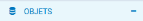
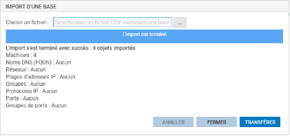

# Fiche 05 -- Configuration des Objets Réseau

Les objets réseau sont notamment nécessaires à la mise en place de
règles de filtrage et de NAT.

## Présentation des Objets

Les menus de configuration des pare-feu Stormshield Network utilisent
des objets qui représentent des valeurs (adresse IP, adresse réseau,
URL, événement temporel, etc.). L'utilisation d'objets au lieu de
valeurs présente deux avantages majeurs :

1.  Cela permet à l'administrateur de manipuler des noms, plus parlants
    que des valeurs.

2.  Dans le cas où une valeur change, il suffira de modifier la valeur
    au niveau de l'objet et non dans tous les menus où l'objet est
    utilisé.

La création et la configuration des objets s'effectuent :

-   Dans le menu : CONFIGURATION / OBJETS
-   Dans le menu raccourci :
    
-   Depuis n'importe quel autre menu via le bouton
    

Les objets sont classés en 3 catégories :

1.  **Objets Réseau** : regroupe tous les objets en relation avec les
    valeurs réseaux (adresse IP, numéro de port, numéro de protocole,
    etc.) et les objets temps (par exemple, **l'objet Machine
    FWOUT_Siege** qui représente la passerelle des agences).
2.  **Objets Web **: groupes d'URL (ou groupes de catégories) et groupes
    de noms de certificats.
3.  **Certificats et PKI** : permet la création et la gestion des
    autorités de certification et de tous les certificats (de type
    serveur, utilisateur, ou smartcard) qui en découlent.

On peut distinguer deux types d'objets particuliers en plus des objets
qui peuvent être créés par l'administrateur :

-   **Objets implicites :** ils sont créés automatiquement par le
    pare-feu et dépendent de la configuration réseau. Ces objets sont en
    lecture seule et ne peuvent être ni modifiés ni supprimés par
    l'administrateur. Par exemple, l'objet « **Firewall_out »**, créé
    automatiquement lorsqu'une adresse IP est associée à l'interface
    «** OUT **» ou l'objet **« Network_internals** **»** qui regroupe
    tous les réseaux accessibles via les interfaces internes.
-   **Objets pré-configurés :** ils sont présents par défaut dans la
    liste des objets. Ils représentent des valeurs de paramètres réseaux
    standardisées (ports, protocoles, réseaux) et des valeurs
    nécessaires pour le fonctionnement du pare-feu (adresse IP des
    serveurs Stormshield pour les mises à jour). On trouvera par exemple
    le protocole ICMP et l'objet « **Internet »** qui regroupe
    l'ensemble des machines ne faisant pas partie des réseaux internes.

!!! Warning  "Attention"
    Il est conseillé d'utiliser les objets implicites et pré-configurés et
    d'éviter de créer d'autres objets portant les mêmes valeurs.

Les recommandations sont les suivantes :

-   **utiliser les objets implicites** ou pré-configurés ;
-   **suivre une convention de nommage** des objets bien définie et
    l'appliquer strictement évite la création de doublons et facilite la
    lecture des objets ;
-   utiliser un **groupe d'objet d'administration** contenant l'ensemble
    des IP et des réseaux d'administration permet de réutiliser ce
    groupe dans toutes les règles de filtrage liées à l'administration
    et donc de maintenir leur cohérence tout en facilitant leur
    modification ;
-   limiter l'usage des objets dynamiques (type FQDN et Dynamic Host) :
    ils génèrent des requêtes DNS régulières. Cela sollicite le réseau
    et le pare-feu, utilisez cette fonctionnalité lorsqu'elle est
    nécessaire ;
-   limiter le nombre d'objets inutilisés : ils chargent l'affichage et
    sont bien souvent oubliés et recréés ;
-   **éviter les doublons**, ils doivent être traqués et supprimés car
    c'est une source d'erreur courante lors de la modification de règles
    de filtrage. On se retrouve dans un cas où la modification d'un
    objet n'impacte pas toutes les règles qui auraient dû l'être, créant
    ainsi des trous dans la sécurité.

La syntaxe des noms des objets (insensible à la casse) doit respecter quelques restrictions définies dans le tableau ci-dessous :

## Création des objets « Réseaux »

Le menu **Configuration** / **Objets **/ **Objets réseau** ou le menu
**Objets réseau** permettent de visualiser les objets, de les modifier
ou d'en ajouter.

-   Ouvrir **Configuration** / **Objets** / **Objets réseau **et cliquer
    sur le bouton **Ajouter** pour ajouter les objets souhaités.

Les types d'objets suivants peuvent être créés :

-   Machine : une adresse IP,
-   Nom DNS (FQDN) : toutes les adresses IP associées à un nom FQDN par
    résolution DNS,
-   Réseau : une adresse réseau,
-   Plage d'adresses IP : une plage d'adresses,
-   Routeur : permet de renseigner une ou plusieurs passerelles pour un
    routage par répartition de charge avec ou sans passerelle de
    secours.
-   Groupe : un groupe d'objets portant une ou plusieurs adresses IP :
    machines, plages d'adresses IP, réseaux ou d'autres groupes,
-   Protocole IP : l'ID du protocole au niveau IP,
-   Port - Plage de ports : un port ou une plage de ports. Il/Elle peut
    être limité(e) à un protocole de transport particulier (TCP ou UDP),
-   Groupe de ports : un groupe d'objets portant des ports ou des plages
    de ports, ainsi que d'autres groupes de ports,
-   Groupe de régions : un groupe de pays ou de continents. Ce type
    d'objet peut être utilisé dans la géolocalisation des adresses IP,
-   Objet temps : un événement temporel (ponctuel, jour de l'année,
    jour(s) de la semaine ou plage(s) horaire(s)).

!!! Warning  "Attention"
    **ATTENTION**, il faut utiliser un typage d'objets adéquat (objet réseau
    pour les réseaux, objet machine pour les pare-feu, etc.).

-   Cliquer sur **+ CRÉER** pour ajouter l'objet.

## Import/Export des Objets

Il est possible d'exporter la base d'objets du pare-feu SNS dans un
fichier CSV en cliquant sur le bouton « **Exporter** ». Le fichier CSV
généré contient les objets machines, plages d'adresses IP, réseaux,
FQDN, ports -- plages de ports, protocoles, groupes et groupes de ports.

Les objets sont organisés par catégorie et séparés par des lignes
contenant les noms des paramètres : #type, #name, #IP, etc. (les
paramètres diffèrent en fonction des catégories d'objets). Les attributs
d'un objet, quant à eux, sont séparés par des virgules.

Il est possible d'importer des objets depuis un fichier CSV possédant le
même format que le fichier exporté.

Un rapport statistique affiche le nombre d'objets importés par type. En
cas d'erreur d'import, la base d'objets n'est pas modifiée.

!!! Danger  "Attention"
    Les objets du fichier importé écrasent ceux du firewall s'ils portent le
    même nom. Les autres objets ne sont pas affectés.

-   Cliquer sur **Exporter**, pour exporter la base d'objets
    précédemment créés dans un fichier CSV.

-   Et cliquer sur **Importer**,

-   Cliquer sur **Importer**, pour importer le fichier CSV après une
    éventuelle modification, puis choisissez le fichier « csv » et
    cliquer sur **Transférer **pour commencer l'import puis **Fermer**.
    Une barre d'avancement permet de visualiser le déroulement de
    l'import. Et une fois fini, un rapport statistique affiche le nombre
    d'objets importés par type.

!!! Info  "Information"
    En cas de problème à l'importation, encodez le fichier en UTF-8 avec des
    retours à la ligne type Unix (LF).