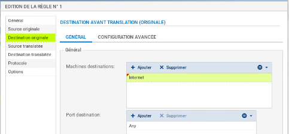
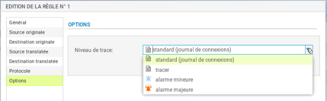
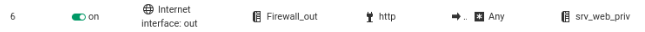
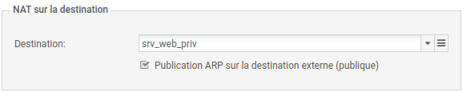

# Fiche 06 -- Configuration du NAT/PAT

Dans les pare-feu SNS, les règles de filtrage et NAT
(traduction d'adresses) sont regroupées sous une même politique. Il est
possible de définir 10 politiques différentes mais une seule politique
est active à la fois, identifiée par l'icône  :

## Mise en œuvre du NAT dynamique

!!! Success  "NAT dynamique"
    **La règle de NAT dynamique NAPT permet aux machines du réseau interne
    (Network_internals) d'accéder au réseau externe (Network_Out) et à
    Internet**

La règle de **NAT dynamique** est créée avec le bouton **Nouvelle
règle** / **règle de partage d'adresse source (masquerading)** qui
ajoute automatiquement la plage de ports
prédéfinie **ephemeral_fw** \[20000-59999\] au niveau du port source
dans le trafic après traduction. Par défaut, les ports sont choisis
séquentiellement dans cette plage, cependant une option est disponible
pour permettre un choix aléatoire du numéro de port pour chaque nouvelle
connexion et le rendre ainsi moins prédictible.

-   Dans votre politique **(10)**, sélectionner l'onglet NAT puis
    **Nouvelle règle** / **règle de partage d'adresse source
    (masquerading)** 

Une nouvelle règle non activée apparaît avec des valeurs par défaut any,
any. Dans la section **Trafic après translation**, le port source sera
traduit par un numéro de port choisi dans la plage **ephemeral_fw**.

La configuration du **Trafic original (avant translation)** permet de
renseigner les valeurs des paramètres avant traduction (par défaut any,
any) :

-   **Source **permet de définir l'adresse IP d'un hôte ou du réseau
    source ;
-   **Destination **permet de définir l'adresse IP d'un hôte ou du
    réseau destination.

La configuration du **Trafic après translation** permet de renseigner
les nouvelles valeurs des paramètres après traduction (par défaut any,
any) :

-   **Source** définit l'adresse IP ou le réseau source et le **port**
    source vus de l'extérieur.
-   **Destination** définit l'adresse IP ou le réseau destination et
    **Port destination** translatée le port de destination.

Pour configurer un NAT/PAT pour permettre la sortie sur Internet

-   Double-cliquer sur une zone vide de la règle pour ouvrir la fenêtre
    de configuration détaillée « **Edition de la règle N°1 **».
-   Cliquer l'onglet du menu de gauche **Général**, dans la
    zone **Commentaire,** saisir un commentaire, par exemple
    « Configuration de la règle de NAT/PAT pour la sortie internet ».
-   Cliquer sur l'onglet du menu de gauche **Source Originale.**
-   Double-cliquer sur Any et avec la flèche choisir
    **Network_internals** (qui renvoie à tous les réseaux internes
    protégés), dans l'onglet Configuration avancée, laissez **Any** pour
    le port de destination.

-   Cliquer sur l'onglet du menu de gauche **Destination originale.**
-   Double-cliquer sur **Any** et avec la flèche choisir **Internet**,
    laissez **Any **pour le port de destination.

!!! Warning  "Attention"
    **Attention** : si dans la zone **destination
    originale**, vous laissez **Any**, plutôt qu'**Internet** qui désigne
    tous les réseaux sauf ceux internes au pare-feu SNS, le pare-feu SNS
    bloquera les flux d'administration (en ssh et en https). En effet, les
    flux d'administration subiront également une traduction NAT vers
    l'interface **OUT** qui l'interprétera comme une tentative d'intrusion
    et les bloquera.

!!! Info  "Solution"
    Vous pouvez rendre cette règle plus restrictive en choisissant
    explicitement l'interface de sortie.

-   Cliquer sur l'onglet **Configuration avancée** et sélectionnez
    **out** dans **Interface de sortie**.

-   Cliquer sur l'onglet **Source translatée** et
    sélectionner **Firewall_Out **dans **Machine source translatée**.
-   Dans **Port source translaté**, laisser **ephemeral_fw **et cocher
    **choisir aléatoirement le port source translaté**.

!!! Info  "Information importante"
    Cette option **choisit aléatoirement le port source
    translaté**, ce qui permet d'éviter les attaques utilisant la
    prédictibilité des ports utilisés. Ainsi si le premier port est 10000,
    le suivant ne sera pas 10001. Cette précaution n'empêche pas les
    attaques, elle permet de les rendre plus complexes.

-   Cliquer l'onglet du menu de gauche **Protocole**, cela permet de
    définir le type de protocole : applicatif, IP ou Ethernet, laisser
    **Détection automatique du protocole (par défaut)**

-   Cliquer sur l'onglet du menu de gauche **Options**, cela permet de
    tracer le trafic qui correspond à la règle de traduction dans le
    journal de connexions, choisir **tracer**.

!!! Info  "Nota Bene"
    NB : Le NAT ne laisse jamais de traces dans le journal de connexions.
    Pour tracer une règle de NAT, il faut choisir l'option « tracer »,
    sinon, aucune journalisation de NAT ne sera effectuée.

-   
-   Cliquer sur **OK** pour sauvegarder les
    modifications de la règle de NAT dynamique que vous venez de créer.
-   Dans la colonne **État**, sélectionner avec la flèche **Définir
    l'état on** 

-   Cliquer sur **Appliquer** puis **Oui, Activer** **la politique**
    puis confirmer.

Dans la liste des règles la barre devient verte quand les règles
s'appliquent et une info-bulle indique le nombre de fois où la règle a
été appliquée :

-   Dans le bandeau d'affichage des règles, déplier le menu
     et cliquer sur **Réinitialiser les statistiques
    des règles **pour remettre les compteurs à zéro.

## Mise en œuvre du NAT statique par port (redirection de port)

**Pour faire une redirection NAT « classique »**, il faut sélectionner
l'onglet **NAT** puis **Nouvelle règle / règle simple.**

**Exemple **avec une règle de NAT afin qu'unserveur WEB (objet
srv_web_priv, protocole http) soit joignable grâce à une redirection de
port via l'adresse IP publique OUT d'un pare-feu: « 192.36.253.70 ».

-   Source originale = **Internet**, Interface d'entrée = **out**

-   Destination originale = **Firewall_Out**, Port dest= **http**

-   Source translatée = **Any (**ou pas de source**)**

-   Destination translatée = **srv_web_priv**, Port destination translaté = **none**

-   Cliquer **Appliquer** puis **Oui, Activer** **la politique** puis
    confirmer.

Le détail ci-dessous :

-   Dans l'onglet **Destination** de la règle de filtrage, choisissez
    l'onglet **Configuration avancée**, puis dans **NAT sur la
    destination**, sélectionner l'objet correspondant à votre serveur
    web privé :

-   Puis dans l'onglet Port/Protocole, choisir http dans la zone Port destination translaté.

Traçage des règles de NAT

Activer le traçage des règles de NAT permet d'avoir les informations
visibles dans les Journaux d'audit (logs).

-   Double-cliquer sur la règle que vous voulez tracer et choisissez
    l'onglet **Options**, et dans niveau de trace **tracer **puis **OK.
    **

Vous pouvez tester l'accès à l'ensemble de vos ressources et vérifier le
traçage des règles demandées dans les logs du pare-feu (journal
**standard** et journal **Filtrage**).

-   Cliquer sur l'onglet **Monitoring **puis **LOGS - Journaux d'audit /
    Vues / Trafic réseau** : vous devriez voir apparaître les traces :

!!! Info  "Information importante"
    Il est également possible de réaliser une redirection de ports
    directement lors de la création d'une règle de filtrage (voir fiche 6).
    L'intérêt d'intégrer le filtrage et la redirection dans une règle unique
    est d'optimiser les performances puisque le pare-feu réalise un seul
    traitement au lieu de deux. Voici un exemple ci-dessous équivalent à la
    règle précédente :

