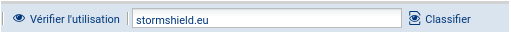
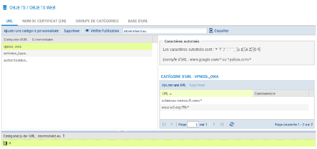
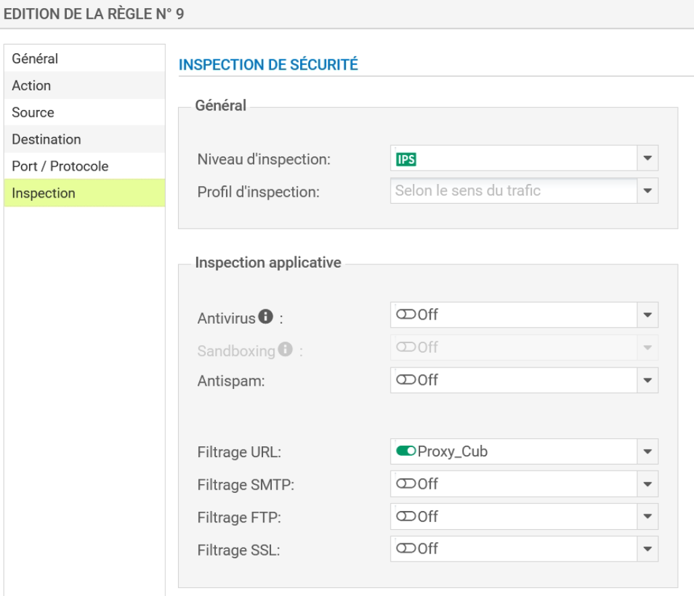
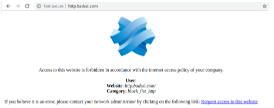
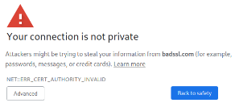
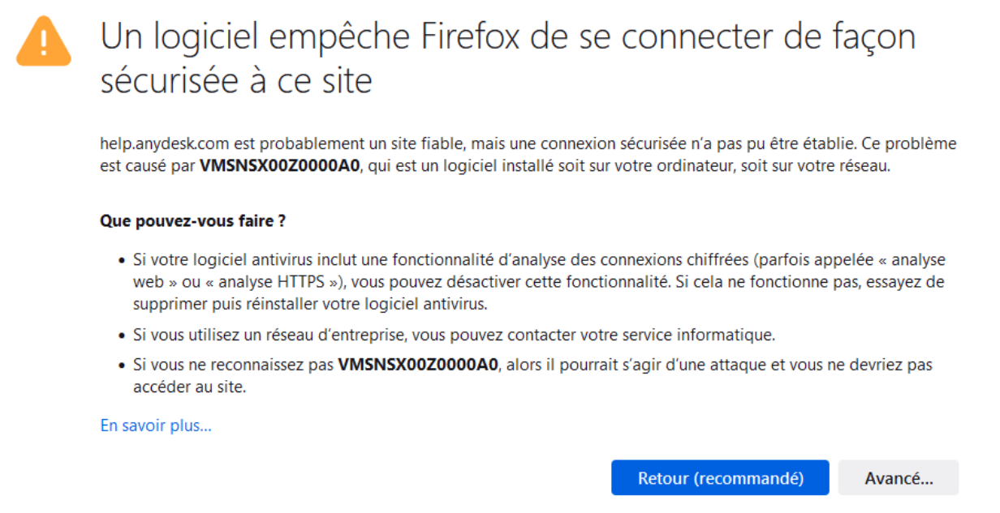
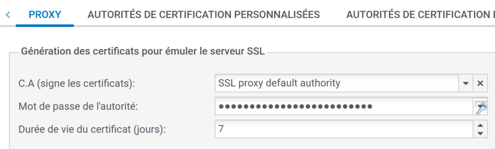

# Fiche 08 -- Filtrage applicatif

La mise en place d'une politique de filtrage, permet à l'administrateur
de définir les règles qui permettront d'autoriser ou de bloquer des flux
au travers du pare-feu SNS. Selon les flux, certaines inspections de
sécurité (analyse antivirale, analyse antispam, filtrage URL, etc.)
peuvent être activées sur les pare-feu SNS afin de :

-   contrôler les accès à certains sites web d'Internet (filtrage d'URL
    et filtrage SSL) ;
-   créer une politique anti-relais et antispam (filtrage SMTP) ;
-   effectuer une analyse antivirale sur les flux DATA (HTTP, SMTP, FTP,
    POP3, etc.) ;
-   bloquer les maliciels à l'aide d'une analyse comportementale sur des
    machines de détonation (sandboxing Breachfighter).

## Configuration du service proxy Web HTTP

La fonction de filtrage des URL permet de contrôler l'accès aux sites
web d'Internet pour l'ensemble des utilisateurs. Pour contrôler ces
accès, la politique de filtrage URL va se baser sur une liste d'URL
classées en catégories ou de mots clés personnalisés.

### Les bases d'URL disponibles

**Deux fournisseurs de base UR**L sont disponibles sur les pare-feu
SNS :

1.  Base URL embarquée composée de 16 catégories téléchargées sur les
    serveurs de mise à jour,
2.  Base Extended Web Control (EWC) constituée de 65 catégories, toutes
    hébergées dans le Cloud. *Cette base est disponible en option
    payante, elle est néanmoins incluse dans les VM du partenariat
    Stormshield Academy.*
-------------------------------

-   Ouvrir **Configuration** / **Objets **/ **Objets Web **onglet **Base
    d'URL**. La base par défaut est la Base URL embarquée.

Les catégories prédéfinies pour la **Base URL embarquée **sont
disponibles. Le contenu des catégories ne peut pas être consulté.
Cependant, l'appartenance d'une URL à un groupe peut être vérifiée par
le biais des champs de classification. Ces champs sont disponibles
depuis le menu Objets Web ou au sein d'une politique de filtrage URL.

Par exemple, pour vérifier l'appartenance de Stormshield à une des
catégories de la base :

-   Ouvrir **Configuration** / **Objets** / **Objets Web **onglet
    **URL**.
-   Dans la zone **Vérifier l'utilisation **saisir **stormshield.eu** et
    cliquer **Classifier**.

Le résultat s'affiche dans la zone de commentaires, l'URL
**stormshield.eu** fait partie de la catégorie **IT** :

-   Au besoin cliquer le symbole au bas de l'écran
     pour déplier la zone de commentaires.

### Politique de filtrage d'URL pré-définie

Une seule politique de filtrage est prédéfinie par défaut (quelle que
soit la politique choisie, ce sont les deux même règles qui
apparaissent).

-   Ouvrir le menu **Configuration** / **Politique de sécurité** /
    **Filtrage URL**
-   Dans la liste déroulante des politiques de sécurité, choisissez
    **(0)
    URLFilter_00**.
    

    -    **La règle numéro 1 **(non activée) autorise les URL qui font partie du
groupe **authentication_bypass** qui peut être consulté dans le menu
**Objets Web**, il s'agit des sites qui permettent les mises à jour
Microsoft.

    -   **La règle numéro 2** laisse explicitement passer tous les flux.

Les règles de filtrage d'URL sont composées d'une colonne **Action** et
d'une colonne **Catégorie d'URL**.

-    La colonne **Action** permet de Bloquer ou de Passer ou **de rediriger** vers l'une des 4 pages de blocage personnalisables.

        

-    **Catégorie d'URL** : La colonne contient la liste des catégories prédéfinies de la base **URL embarquée** et les catégories personnalisées que vous avez créées. 

 

Il convient ensuite de choisir les catégories de sites à autoriser,
bloquer ou à rediriger vers l'une des 4 pages de blocage
personnalisables. Le contrôle de cohérence en temps réel affiche les
erreurs détectées dans votre politique.

### Création d'une base URL personnalisée

Si les catégories de sites web prédéfinies par votre base d'URL ne sont
pas exactement adaptées à vos besoins, il est nécessaire de créer ses
propres catégories pour y mettre les URL que l'on souhaite bloquer ou
autoriser.

!!! Info  "Information importante"
    Il est recommandé de prévoir au moins une catégorie de type « white
    list » et une catégorie de type « black list ».

-   Dans l'onglet URL, cliquer sur **Ajouter une catégorie
    personnalisée** puis donnez-lui un nom (par exemple black_list).
-   Dans la zone Catégorie d'URL, cliquer sur **Ajouter une URL** et
    saisir par exemple \*.badssl.com/\*.

!!! Info  "Information iminteressante"
    Le site **badssl.com** permet d'effectuer de nombreux tests de
    configuration des navigateurs Internet. En particulier l'URL
    **http.badssl.com** permet de tester l'affichage d'une page web en HTTP.

### Création d'une règle de blocage

!!! Info  "Information"
    Ce qui suit est valable pour n'importe quelle catégorie mais le mode
    opératoire porte sur la catégorie personnalisée « black_list ».

-   Dans la liste déroulante des politiques de sécurité, choisir une des
    règles de politique de filtrage d'URL (par exemple, **(0)
    URLFilter_00**)** et **cliquer sur **Éditer.**

-   Renommer cette politique (par exemple  « Proxy_Cub ») et mettre à
    jour.

-   Se positionner sur la première règle (désactivée) et cliquer **+
    Ajouter** pour ajouter une nouvelle règle de filtrage d'URL.

-   Au niveau de la deuxième règle, dans **Action**, laisser
    **BlockPage_00 **et dans la colonne **Catégorie d'URL**, choisir
    **black_list, **puis** **cliquer sur **Appliquer **puis sur
    **Sauvegarder**.

!!! Info  "Information"
    Les pages de blocage par défaut, ici **BlockPage_00 **peuvent être
    éditées depuis le menu **Configuration **⇒ **Notifications **⇒
    **Messages de blocage **⇒ Onglet **Page de blocage HTTP**. Les
    modifications peuvent s'effectuer grâce à l'éditeur HTML, **cela permet
    de personnaliser la page.**

### Affectation d'une politique de filtrage URL

-   Ouvrir **Configuration / Politique de sécurité / Filtrage et NAT**,
    et choisir la politique de sécurité actuellement appliquée.
-   Dans l'onglet **Filtrage**, ouvrir la ou les règles qui autorisent
    l'accès à Internet avec le protocole **http**. Dans l'onglet
    **Inspection de sécurité**, dans la zone **Inspection **choisir,
    dans la liste **Filtrage URL,** la politique de filtrage URL à
    appliquer.

Vous devez obtenir la règle suivante :

!!! Warning  "A vérifier"
    

Na pas faire attention à l'avertissement. En cas d'accès à un site en
HTTPS, il faudra effectivement d'abord déchiffrer le flux pour pouvoir
décider du blocage ou non, ce qui nécessite l'utilisation d'un proxy SSL
(voir partie suivante).

Pour tester

-   Ouvrir la page web **http.badssl.com** depuis votre navigateur, elle
    ne doit pas s'afficher correctement. Vous devez voir le message de
    blocage ci-contre :

### Configuration du service proxy Web HTTPS

De nombreux services réseau tels que le web, la messagerie, la
messagerie instantanée, utilisent le protocole SSL/TLS pour authentifier
les correspondants et chiffrer leurs communications.

Les pare-feu SNS sont capables de filtrer et déchiffrer les connexions
HTTPS, ce qui permet :

-   de bloquer des sites web HTTPS ou des catégories de sites web HTTPS
    inappropriés ;
-   d'analyser les flux HTTPS pour les fonctions de protection
    applicative (e.g., anti-virus, sandboxing, filtrage URL, Google
    SafeSearch, etc.).

Deux méthodes sont envisageables pour filtrer les connexions HTTPS :
**avec** ou **sans** déchiffrement des flux SSL. Ces deux méthodes
peuvent être combinées en fonction de différents critères, tels que
l'authentification, le réseau IP source ou certaines URL de destination.

#### Principe du filtrage SANS déchiffrement des flux SSL

Cette méthode permet de bloquer les sites web HTTPS indésirables en
vérifiant seulement leur certificat sans déchiffrer le flux. Ainsi,
lorsqu'un client initie une connexion vers un site en HTTPS, il envoie
en clair au serveur le nom de domaine du site demandé.

Ce mécanisme appelé **Server Name Indication** (SNI) permet au serveur
de sélectionner le bon certificat à présenter au client. Stormshield
Network Security s'appuie sur ce système pour contrôler l'accès à ces
sites web sans déchiffrer le flux.

Avec ce type de filtrage, les pare-feu SNS sont compatibles avec les
extensions SNI (Server Name Indication), permettant de décrire
explicitement le nom de l'hôte avec lequel une session TLS est en
négociation. Un message de certificat invalide apparaîtra en cas de
blocage puis une page de blocage non personnalisable.

Si vous choisissez **Advanced** et **Proceed**, vous aurez accès à la
page de blocage du pare-feu SNS :

En revanche, cette méthode ne permet pas d'analyser les connexions HTTPS
avec les protections applicatives tels que l'anti-virus, le sandboxing,
Google SafeSearch.

!!! Info  "Information"
    Une combinaison des deux méthodes (voir ci-après) est plus judicieux.

#### Principe du filtrage AVEC déchiffrement des flux SSL

Le proxy SSL est positionné en « homme du milieu » (Man in the middle)
sur le trafic SSL entre le client et le serveur web. Il se charge des
négociations SSL et sécurise ainsi les connexions proxy SSL/serveur, et
proxy SSL/client. Entre les deux, il autorise ou bloque les connexions
selon la politique de filtrage, et si besoin, il déchiffre les flux SSL.

!!! Danger  "Attention"
    Le déchiffrement des données personnelles étant encadré
    par la loi dans la majorité des pays, le filtrage SSL doit prendre en
    compte cette législation. Vous devez exclure les sites qui ne doivent
    pas être déchiffrés en leur appliquant l'action **Passer sans déchiffrer
    **(e.g., en France les sites bancaires). Pour la France, les aspects
    juridiques liés au déchiffrement SSL sont détaillés en annexe du
    document [*Recommandations de sécurité concernant l'analyse des flux
    HTTPS*](https://www.ssi.gouv.fr/uploads/IMG/pdf/NP_TLS_NoteTech.pdf) de
    l'ANSSI.

!!! Info  "Attention"
    Il est nécessaire de  comprendre les étapes
    du filtrage SSL.avec déchiffrement et les éléments de configuration
    pré-définis.

-   Ouvrir le menu **Configuration** / **Politique de sécurité** /
    **Filtrage SSL**

-   Dans la liste déroulante des politiques de sécurité, choisir par
    exemple **(0) SSLFilter_00**.

-   Éditer un des 10 profils et le renommer (par exemple, renommer **(0)
    SSLFilter_00** en proxy_SSL)

Pour chacune des 10 politiques de filtrage par défaut, deux règles sont
présentes. La **règle numéro 1** spécifie de **Passer sans déchiffrer
**les **URL-CN** qui font partie de la catégorie **proxyssl_bypass**. En
effet, ces serveurs détectent que le proxy SSL génère un certificat
usurpé et sont susceptibles de refuser les connexions (c'est le cas par
exemple de mozilla.org).

**La règle numéro 2** spécifie de déchiffrer tous les autres.

La catégorie par défaut **proxyssl_bypass** contient donc une liste de
noms de certificats que Stormshield recommande de laisser passer sans
déchiffrer.

Il est possible d'ajouter ou de supprimer un nom de certificat (CN) de
cette catégorie.

-   Pour créer, si besoin, une nouvelle catégorie : menu **CONFIGURATION
    ⇒ OBJETS ⇒ Objets Web**, dans l'**onglet NOM DE CERTIFICAT (CN).**
-   Pour créer, si besoin, un groupe de catégorie :menu **CONFIGURATION
    ⇒ OBJETS ⇒ Objets Web**, dans l'onglet GROUPE DE CATÉGORIES, choisir
    un **objet de type groupe de catégories Certificats**. Un groupe de
    catégories peut être composé de catégories présentes dans la base
    (EWC ou embarquée), mais aussi de catégories personnalisées.

Une règle définit l'action donc à appliquer pour une catégorie d'URL-CN.
Après la réception du certificat serveur et la confirmation que le SNI
demandé correspond au CN (common name) du certificat ou à un des noms
alternatifs, le SNI est confronté aux règles de filtrage SSL. Dans le
cas où une règle correspond, l'action de la règle est appliquée :

-   > **Déchiffrer :** le proxy SSL établit une session TLS avec le
    > serveur et une autre avec le client en lui présentant le
    > certificat usurpé.

-   > **Bloquer sans déchiffrer :** le proxy SSL ferme les connexions
    > TCP avec le serveur et le client après l'établissement des
    > sessions TLS. Le client recevra quand même le certificat usurpé.

-   > **Passer sans déchiffrer :** le proxy SSL ferme la connexion TCP
    > après l'établissement de la session TLS et ouvre une deuxième
    > connexion TCP pour renvoyer les commandes TLS du client.

!!! Info  "Attention"
    Pour les actions Bloquer sans déchiffrer et Passer sans déchiffrer, le
    trio \[IP, port, SNI\] est ajouté au cache du proxy SSL pour appliquer
    l'action dès la réception du SNI lors d'une prochaine connexion au
    même serveur.

!!! Warning  "Attention"
    Pour limiter l'impact du proxy SSL sur les performances du pare-feu, le
    filtrage SSL peut être utilisé pour passer sans déchiffrer plusieurs
    sites qui ne représentent pas une menace sur la sécurité de
    l'entreprise, par exemple les sites de mises jours des systèmes et des
    logiciels.

Après avoir (si besoin) modifié un profil, il convient d'activer le
proxy SSL.

#### Activation du proxy SSL

##### Méthode 1 : utilisation de l'assistant

-   Se rendre dans le menu **CONFIGURATION ⇒ POLITIQUE DE SÉCURITÉ ⇒
    FILTRAGE ET NAT =\> onglet FILTRAGE** pour y ajouter la règle
    d'inspection SSL.

L' assistant « Règle d'inspection SSL » a pour but de créer des règles
inspectant le trafic chiffré SSL. Il est conseillé de passer par cet
assistant pour la **génération des deux règles indispensables au bon
fonctionnement du proxy SSL.**

!!! Warning  "Attention"
    Les deux règles sont créées même s'il y avait auparavant une règle pour
    le trafic HTTPS. Il ne faut alors garder que la première et modifier
    l'une des deux règles concernant le trafic HTTPS et supprimer l'autre.

-   Définir, dans la première zone, la politique du trafic à déchiffrer
    en indiquant :

    -   les machines sources (« Network_internals » par défaut) ;
    -   l'interface d'entrée (« any » par défaut) ;
    -   la destination (« Internet » par défaut) et le port de destination
        (« ssl_srv » par défaut) parmi la liste déroulante d'objets : il
        contient les ports standards des services utilisant une session TLS
        : HTTPS, IMAPS, LDAPS, SMTPS, etc.

-    Définir, dans la deuxième zone :

    -    le profil d'inspection : il est possible de choisir un profil
         défini au préalable

    -    Politique de filtrage SSL : il est possible de chosir une
         politique de filtrage préalablement définie (ou une de celle par
         défaut). *Dans le cas où aucune politique de filtrage n'est
         configurée, l'action Déchiffrer sera appliquée par défaut pour
         tous les serveurs.*

-   Vous pouvez également activer l'Antivirus ou l'Antispam et
    sélectionner des politiques de filtrage URL, SMTP, FTP ou SSL
    (vérification du champ CN du certificat présenté).

Afin d'Inspecter le trafic déchiffré via la seconde zone de la fenêtre
de l'assistant, vous pourrez définir la configuration du Profil
d'Inspection, en choisissant l'une de celles que vous avez définies au
préalable ou laisser en mode « Auto ». Ce mode automatique appliquera
l'inspection relative à l'origine du trafic.

**L'assistant crée deux règles de filtrage :**

1\. **La première règle** est utilisée pour intercepter les flux
provenant du réseau interne à destination d'internet sur le groupe de
port ssl_srv. Ces flux sont translatés à destination du proxy SSL qui
écoute sur 127.0.0.1:8084. Cette règle applique l'action déchiffrer et
le filtrage SSL.

2\. **La deuxième règle** autorise les flux provenant du réseau interne
et sortant du proxy SSL (Via SSL proxy) à destination d'Internet. Les
protections applicatives (Filtrage URL, Antivirus, antispam, etc.)
doivent être activées sur cette règle.

##### Méthode 2 : création des deux règles

-   **Cliquer Nouvelle règle / règle simple**

La suite est classique jusqu'à inspection :

On obtient la règle :

-   **Cliquer Nouvelle règle / règle simple (ou modifier une règle
    existante)**

**Installation du certificat racine dans les navigateurs**

Une fois le proxy SSL activé, le client qui tente de se connecter à un
site HTTPS déchiffré, voit une alerte s'afficher dans le navigateur pour
l'informer que le certificat reçu n'est pas signé par une autorité
connue. Cette alerte s'explique par le fait que le proxy SSL envoie un
certificat usurpé signé par une autorité (CA) non publique.

!!! Warning  "A lire attentivement"
    **Pour éviter l'affichage de cette alerte, il faut installer le
    certificat de l'autorité de certification racine (CA) utilisée par le
    proxy SSL dans le navigateur (pour Firefox) ou dans le magasin de
    certificats du système d'exploitation (pour Internet Explorer, Edge et
    Chrome) et la déclarer comme une autorité racine de confiance**.

**Plusieurs méthodes **pour récupérer le certificat de le CA utilisée
par le proxy SSL, dont :

-   Récupérer le certificat de la CA **directement depuis le
    navigateur** quand le message d'alerte s'affiche (ou en cliquant sur
    Erreur de certificat, puis Voir le certificat, mettez la CA racine
    en surbrillance, et cliquez sur Exporter vers un fichier.
-   Ou récupérer le certificat de la CA via l'interface web du firewall,
    dans le menu **CONFIGURATION ⇒ OBJETS ⇒ CERTIFICATS ET PKI**

Puis

-   **Sur Firefox, suivre la procédure ci-dessous :**

1\. Taper about:preferences#privacy dans la barre de recherche, puis
cliquez sur le bouton Afficher les certificats en bas de page,

2\. Aller dans l'onglet Autorités et cliquez sur le bouton Importer,

3\. Choisir le fichier de la CA racine,

4\. Dans la fenêtre Téléchargement de certificats, cocher la case
Confirmer cette AC pour identifier des sites web, puis cliquez sur le
bouton OK.

5\. Vérifier que l'import est effectif (le classement dans Firefox est
effectué par le nom d'organisation décrit dans le certificat).

**Sur Windows**, le certificat est ajouté au magasin de certificats du
système d'exploitation, utilisé par les navigateurs Edge et Chrome (et
Internet Explorer).

-   Suivre la procédure ci-dessous :

1\. Cliquer droit sur le certificat à installer et choisissez l'option
Installer le certificat,

2\. Dans l'assista􀅶t, choisir le magasin pour l'Utilisateur actuel,

3\. Sélectionner le magasin de certificats Autorités de certification
racines de confiance.

!!! Warning  "Information utile"
    Dans un domaine Active Directory, il est plus
    simple d'automatiser le déploiement du certificat de la CA par
    l'utilisation des stratégies de groupe (GPO).

    -   Le magasin de certificats de Windows est accessible par le menu
    Démarrer, Exécuter, tapez certmgr.msc.

## Documents

### Document 1 : Les éléments de configuration par défaut

#### Configuration du proxy SSL

La configuration du proxy SSL s'effectue dans le menu **CONFIGURATION ⇒
PROTECTION APPLICATIVE ⇒ Protocoles ⇒ SSL ⇒ Profil ssl_01 ⇒ onglet
PROXY**

L'encadré **Inspection de contenu** permet de
définir l'action (déléguer à l'utilisateur, bloquer ou
continuer l'analyse) qui doit être appliquée par le proxy dans le cas où
le certificat présenté par le serveur distant est :

-   un certificat auto-signé ;
-   un certificat non valide ;
-   un certificat signé par une autorité inconnue ;
-   un certificat avec un type inconnu ou non conforme ;
-   un certificat avec un nom CN incorrect ;
-   un certificat dont le CN et les noms alternatifs ne correspondent
    pas au FQDN du serveur (SNI).

L'option Autoriser les adresses IP dans les noms de domaine SSL permet
d'accéder à un site en utilisant son adresse IP à la place de son nom
FQDN.

L'encadré **Support** contient deux options pour définir l'action à
appliquer (Bloquer ou Passer sans déchiffrer) dans le cas où le
déchiffrement échoue et dans le cas où le certificat ne peut être
classifié dans les catégories de la base URL (base embarquée ou Extended
Web Control).

!!! Info  "Information utile"
    Dans le cas où l'accès à un site est bloqué par le proxy SSL à cause
    d'un des contrôles ci-dessus, l'utilisateur voit sur son navigateur un
    message indiquant la raison du blocage.

**Cette configuration par défaut peut convenir dans la majorité des
cas.**

#### Gestion des certificats des autorités publiques

Lorsque le proxy SSL reçoit le certificat du serveur distant, il vérifie
s'il est signé par une autorité de confiance publique ou privée. Les
autorités de confiance publiques sont préconfigurées et elles sont mises
à jour automatiquement par le module Active Update.

Elles sont accessibles depuis le menu **CONFIGURATION ⇒ PROTECTION
APPLICATIVE ⇒ Protocoles ⇒ SSL ⇒ Accéder à la configuration globale ⇒
AUTORITÉS DE CERTIFICATION PUBLIQUES**. L'interface permet
d'activer/désactiver une autorité en cas de besoin.

##### Configuration de l'autorité signataire des certificats usurpés

Par défaut, le proxy SSL signe les certificats usurpés avec l'autorité
SSL proxy default authority déjà présente sur le firewall. La
modification de cette autorité s'effectuedans le menu CONFIGURATION ⇒
PROTECTION APPLICATIVE ⇒ Protocoles ⇒ SSL ⇒ Accéder à la configuration
globale ⇒ onglet PROXY.

Il suffit de sélectionner la nouvelle autorité dans C.A (signe les
certificats) et son mot de passe dans Mot de passe de l\'autorité.

!!! Warning  "Information importante"
    
    Si vous modifiez le CA par défaut, veillez à sauvegarder son mot de
    passe dans le cas d'une réutilisation future. Le mot de passe peut être
    affiché en clair en cliquant sur l'icône représentant une clé.

Il est également possible d'ajouter une autorité privée (non publique)
de confiance via le menu CONFIGURATION ⇒ PROTECTION APPLICATIVE ⇒
Protocoles ⇒ SSL ⇒ Accéder à la configuration globale ⇒ AUTORITÉS DE
CERTIFICATION PERSONNALISÉES. Dans ce cas, vous faites confiance à tous
les certificats signés par cette autorité.

**Ajouter un certificat serveur** se réalise via le menu CONFIGURATION ⇒
PROTECTION APPLICATIVE ⇒ Protocoles ⇒ SSL ⇒ Accéder à la configuration
globale ⇒ CERTIFICATS DE CONFIANCE.

### Document 2 : Les étapes du filtrage SSL AVEC déchiffrement

Pour pouvoir analyser les données chiffrées par un tunnel TLS, les
firewalls SNS utilisent le proxy SSL qui est positionné comme « homme du
milieu (man in the middle) » entre le client et le serveur durant
l'ouverture de la session TLS. La figure ci-dessus illustre les
différentes étapes de l'ouverture d'une session TLS pour une connexion
HTTPS au travers du proxy SSL.

##### Interception de la connexion par le proxy SSL :

La connexion du client sur le port TCP/443 est translatée vers le proxy
SSL qui écoute sur 127.0.0.2:8084. Le proxy SSL commence par parcourir
un cache contenant une liste de serveurs identifiés par le trio \[IP,
port, SNI\] déjà visités. Ces serveurs peuvent avoir deux états :

-   **Bloquer :** cet état est dû au fait que le serveur est bloqué
    par la politique de filtrage SSL avec l'action bloquer sans
    déchiffrer ou bien le serveur a présenté un certificat qui n'a pas
    pu être validé par le pare-feu. Dans ce cas, le proxy SSL continue
    l'ouverture de la session TLS avec le client pour lui envoyer un
    message de blocage. Aucune connexion ne sera initiée avec le
    serveur.

-   **Passer sans déchiffrer :** cet état est engendré par l'action
    passer sans déchiffrer appliquée à ce serveur par le filtrage SSL.
    Dans ce cas, le proxy SSL initie une connexion TCP avec le serveur
    pour renvoyer les commandes TLS du client.

    ----------------------

1.  Ouverture d'une nouvelle session TLS par le proxy SSL à
    destination du serveur :

Dans le cas où aucune entrée n'est trouvée dans le cache pour ce site, à
la réception du message client Hello qui contient le nom du serveur SNI,
le proxy SSL entame une nouvelle connexion TCP et une nouvelle session
TLS à destination du serveur.

2.  Vérification du certificat serveur :

À cette étape, le proxy analyse le certificat envoyé par le serveur. Il
mettra fin à la connexion dans les cas suivants :

-   Le serveur ne fournit pas d'informations SSL,

-   Le certificat est auto-signé (ce choix est paramétrable),

-   Le certificat du serveur n'est pas signé par une autorité de
    certification de confiance et il n'est pas explicitement déclaré
    en exception (ce choix est paramétrable),

-   Le certificat du serveur a expiré (ce choix est paramétrable),

-   Le certificat du serveur est révoqué (seulement pour une CA «
    custom » pour laquelle la CRL est accessible),

-   Le serveur demande une authentification,

-   Le SNI ne correspondant pas au CN du certificat ni à aucun des
    noms alternatifs

Lorsque le certificat serveur n'est pas conforme, l'accès au site est
bloqué.

##### Application du filtrage SSL :

Après la validation du certificat, le SNI est confronté aux règles de
filtrage SSL pour déterminer l'action à appliquer au serveur :

**Déchiffrer, Bloquer sans déchiffrer** ou **Passer sans déchiffrer**.
Si c'est cette dernière qui est appliquée, le proxy SSL ferme la
connexion TCP avec le serveur une fois la session TLS établie. Puis il
ouvre une nouvelle connexion TCP dans laquelle, il renverra les
commandes TLS du client.

-    Établissement de la session TLS \[Firewall -- Serveur\] :

Dans le cas où l'action Déchiffrer est appliquée, le proxy SSL finalise
l'ouverture de la session TLS avec le serveur. À ce stade toutes les
communications entre le pare-feu et le serveur sont chiffrées par la clé
K1.

-    Génération d'un certificat usurpé (Fake Certificate) :

Si l'action à appliquer est Déchiffrer ou Bloquer sans déchiffrer, **le
proxy génère dynamiquement un certificat qui présente le CN du
certificat du serveur distant **ainsi que ses noms alternatifs. Les
principales différences dans ce certificat sont les **informations de
l'émetteur et la signature effectuée par l'autorité dédiée au proxy
SSL**.

-     Établissement de la session TLS \[Firewall -- Client\] :

Le proxy SSL finalise l'établissement de la session TLS initiée par le
client en lui présentant le certificat usurpé. Le client effectue une
vérification du certificat. Dans le cas où le certificat de l'autorité
signataire n'a pas été préalablement installé, dans le navigateur (pour
Firefox) ou dans le système (pour Internet Explorer, Edge et Chrome), et
déclaré comme une autorité de confiance, un message d'erreur s'affiche
pour signaler au client que l'autorité signataire n'est pas connue.
Toutes les communications entre le client et le firewall sont chiffrées
avec la clé K2.

Après l'étape 7, le trafic est sécurisé par la session TLS 1 entre le
client et le firewall et par la session TLS 2 entre le firewall et le
serveur. Ceci permet au firewall d'appliquer les protections
applicatives sur le trafic qui transite en clair entre les deux sessions
TLS.
