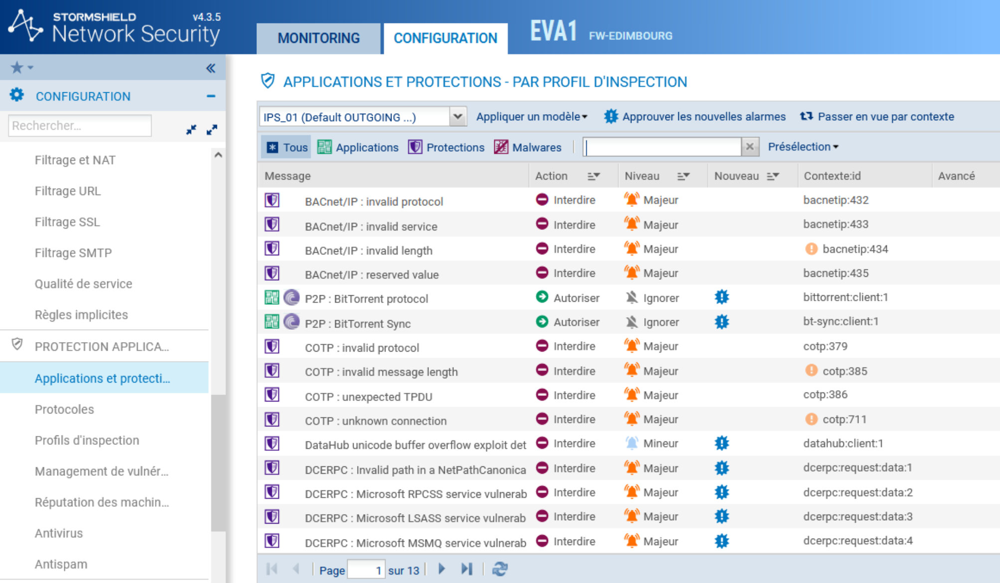
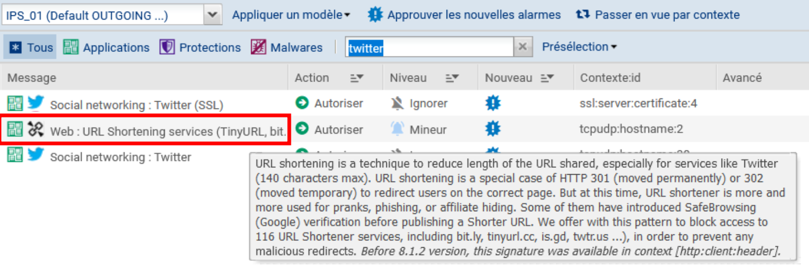
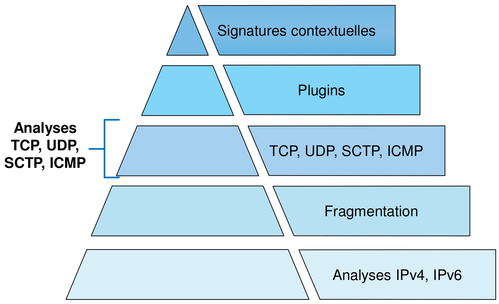
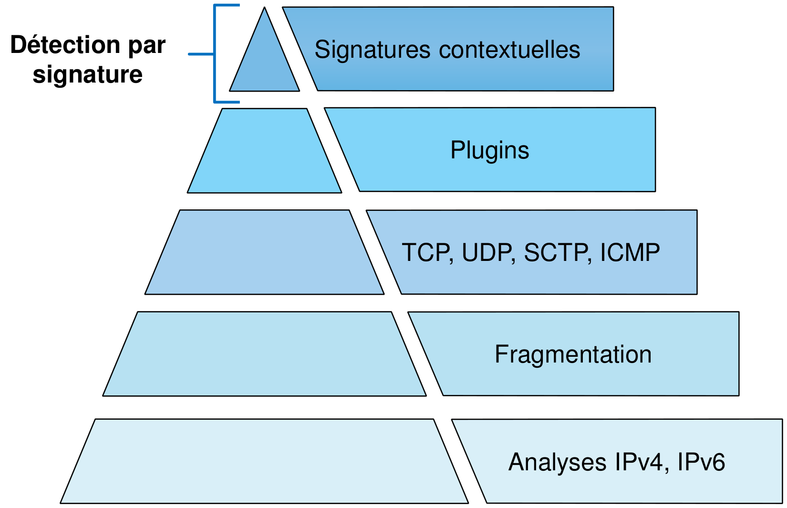

# Fiche 09 -- Prévention d'intrusion IDS/IPS

## Définition rapide des systèmes IDS et IPS

### IDS (Intrusion Detection System)
Un **IDS** est un système de détection d'intrusion qui surveille le réseau ou les systèmes pour détecter des activités malveillantes ou non autorisées. Il analyse le trafic réseau ou les logs des systèmes et alerte les administrateurs lorsqu'une menace potentielle est identifiée. L'IDS est passif et ne bloque pas les attaques, mais fournit des informations précieuses pour la réponse aux incidents.

### IPS (Intrusion Prevention System)
Un **IPS** est un système de prévention des intrusions qui surveille également le réseau pour détecter des activités malveillantes, mais en plus, il prend des mesures proactives pour empêcher ces menaces. Lorsqu'une activité suspecte est détectée, l'IPS peut bloquer le trafic ou interrompre la connexion afin de prévenir des dommages potentiels. L'IPS est considéré comme actif, car il protège activement le réseau contre les intrusions.

## Présentation générale

Les équipements Stormshield Network Security sont équipés nativement
d'un **module de prévention d'intrusion** nommé **ASQ (Active Security
Qualification**). Chaque paquet reçu par le pare-feu SNS sera soumis à
un ensemble d'analyses à commencer par la vérification du protocole IP.
Le rôle principal de l'ASQ est de s'assurer de la conformité du paquet
par rapport aux protocoles utilisés de la couche IP jusqu'à la couche
applicative (grâce aux plugins) et aux signatures contextuelles (ou
Patterns). C'est également l'ASQ qui est en charge de filtrer les flux
et d'appliquer une opération de NAT si nécessaire.

Intégré à la pile réseau du système d'exploitation FreeBSD, le moteur de prévention d'intrusion ASQ dispose d'un accès privilégié aux ressources matérielles (CPU, mémoire et carte réseau).

Ce système de prévention d'intrusion assure le filtrage des flux ainsi que leur analyse : dès les couches de transport et jusqu'aux couches applicatives, il applique des contrôles génériques de conformité, ainsi que des contrôles ciblés et comportementaux. Les opérations de NAT ainsi que certaines opérations de routage spécifique sont également prises en charge par ce moteur.

Ces analyses sont appliquées directement sur les connexions cherchant à traverser la pile réseau du système.

Le **système de prévention d'intrusion **ou **IPS **(Intrusion
Prevention System) **détecte** et **bloque** les tentatives d'attaques
des applicatifs grâce à des analyses contextuelles et comportementales
complétées par une identification par signatures. Cette association
présente deux bénéfices majeurs :

-   il permet de réaliser un traitement préventif sur toutes les couches
    de communication (du réseau à l'application) fournissant ainsi une
    réelle protection 0-day ;
-   l'usage des contextes applicatifs limite le nombre de signatures à
    examiner et réduit ainsi les risques de faux positifs tout en
    optimisant les temps de traitements pour procurer des performances
    optimales.

Les signatures utilisées par le moteur de prévention d'intrusion SNS
sont construites pour détecter des attaques identifiables mais également
leurs variantes potentielles. À titre d'exemple, la signature
contextuelle sur une injection SQL par une commande SELECT
(http:url:decoded:95) permet de contrer plus de 1 540 variantes
d'attaques. En plus de maintenir un espace de stockage contenu, cette
technique permet d'optimiser les temps de traitement et propose une
protection contre de futures attaques basées sur les mêmes principes.

La **mise à jour des bases de signatures du moteur de prévention**
Stormshield Network Security est assurée indépendamment de la mise à
jour du firmware pour garantir une actualisation périodique et
automatique afin de rester constamment protégé contre les nouvelles
attaques.

Cette fonctionnalité de mise à jour automatique se nomme « Active
Update » ; elle permet également d'ajouter de nouveaux contextes pour
intégrer de nouvelles catégories de signatures contextuelles.

###Les différents types d'analyses

Au-delà du simple classement \[niveau réseau\]\[niveau applicatif\], un
pare-feu SNS protège le réseau selon trois familles d'analyses :

-   **l'analyse protocolaire** : elle assure la conformité des flux
    réseau vis-à-vis des standards de communication (IP, TCP, UDP, etc.)
    ainsi que la conformité aux protocoles applicatifs (HTTP, FTP, etc.)
    grâce aux contrôles appliqués par les contextes applicatifs,
-   **l'analyse statistique **: basée sur des études statistiques du
    trafic transitant par le pare-feu, cette analyse détecte des
    comportements assimilables à du scan de ports, à du SYN flooding, ou
    encore à des tentatives de DoS (Denial of Service) par maintien de
    multiples connexions annonçant des petites fenêtres (SockStress),
-   **l'analyse par signatures contextuelles** : elle vient compléter
    les contrôles de conformité sur le trafic. Cette analyse permet de
    se protéger de tentatives d'attaques visant spécifiquement un
    protocole et une implémentation cliente ou serveur, mais sans
    toutefois recourir à une inconformité au standard de communication.
    Elle s'appuie sur des bases de signatures construites par
    Stormshield, maintenues quotidiennement et mises à disposition sur
    les serveurs Active Update.

### Les niveaux d'inspection de sécurité

Chaque paquet reçu par le pare-feu SNS est soumis à la politique de
filtrage.

!!! Info  "Info"
    Par défaut, l'analyse IPS (Intrusion Prevention System : système de
    prévention d'intrusion) est appliquée, ce qui signifie que le pare-feu
    SNS est capable de détecter une anomalie et de **bloquer** le paquet
    correspondant.

D'autres niveaux d'inspections peuvent être utilisés, à des fins de
tests ou par nécessité : par exemple si on contacte un serveur ne
respectant pas la RFC des protocoles qu'il gère.

Ces niveaux sont à sélectionner dans la colonne **Inspection de sécurité
**de la règle de filtrage concernée.

-    IPS : Détecter et bloquer (choix par défaut).

-    L'ASQ va soumettre le paquet à l'ensemble des couches qu'il est capable d'analyser et le bloquer en cas d'anomalie.

-    IDS : Détecter. L'ASQ effectue une analyse similaire à l'IPS sauf que le paquet est toujours autorisé. C'est un profil permettant de faire un      audit rapide pour une règle de filtrage donnée.

-    Pare-feu : ne pas inspecter. L'ASQ ne va effectuer que très peu d'analyses sur le paquet reçu. Il se comporte comme un simple routeur filtrant.

L'ASQ est composé de 10 configurations (également nommées **profils
IPS**). Chacune de ces configuration peut être éditée en fonction des
besoins de l'administrateur.

### Configuration des profils d'inspection

La configuration par défaut, comme indiqué dans le menu
**Configuration **⇒ **Protection applicative **⇒ **Profils
d'inspection**, applique les profils **IPS_00** et **IPS_01**
respectivement aux connexions **entrantes** (paquet dont l'adresse IP
source ne fait pas partie d'un réseau protégé) et aux connexions
**sortantes** (paquet dont l'adresse IP source fait partie d'un réseau
protégé).

Si des flux sains déclenchent des alarmes, il sera sûrement nécessaire
de modifier les paramètres de l'ASQ pour ne pas bloquer la production.
Dans ce cas, les modifications doivent être faites au plus spécifique.
De préférence dans un profil dédié qui sera appliqué sur les règles
identifiant précisément le trafic concerné.

Il est alors possible, dans la table de filtrage, de forcer
l'utilisation d'un profil ASQ spécifique depuis la colonne **Inspection
de sécurité**.

Par défaut, l'IPS est actif sur toutes les règles de filtrage en mode de
**détection automatique du protocole**. Afin de mieux inspecter les
flux, il est recommandé de qualifier manuellement le type de protocole
si le port utilisé n'est pas standard. L'IPS risquerait de ne pas
détecter correctement l'application.

-   Les profils sont configurables et administrables depuis les menus
    **Protocoles et Applications et protections** sous **Configuration
    **⇒ **Protection applicative**.

Par défaut, la liste des évènements est affichée en vue par profil
d'inspection. Pour tous les évènements, une action et un niveau d'alerte
sont pré-paramétrés :

-   Action

    -   **Autoriser** : le moteur de prévention d'intrusion laisse
        passer le paquet correspondant à l'alarme ;
    -   **Interdire** : le moteur de prévention d'intrusion bloque le
        paquet correspondant à l'alarme.

-   Niveau

    -   **Majeur** : le moteur de prévention d'intrusion émettra une
        alarme majeure sur détection de l'évenement ;
    -   **Mineur** : le moteur de prévention d'intrusion émettra une
        alarme mineure sur détection de l'évenement ;
    -   **Ignore** : le moteur de prévention d'intrusion n'émettra
        aucune alarme sur détection de l'évenement. L'action définie
        sera donc appliquée silencieusement.

Tri sur les trois catégories d'alarme

Des boutons vous permettent d'effectuer un tri sur les alarmes du profil
d'inspection. Les 3 catégories dans lesquelles ces alarmes sont
réparties sont **Applications**, **Protections** et **Malwares**. La
sélection s'effectue par les 3 boutons du même nom :

-   Applications : ce type d'alarme est levé par l'utilisation
    d'applications courantes. Cette sélection permet l'élaboration d'une
    politique de sécurité applicative.
-   Protections : ces alarmes sont levées suite à l'analyse effectuée
    par le moteur IPS : elles résultent du blocage d'attaques connues ou
    d'utilisations anormales des protocoles conformément aux RFC.
-   Malwares : ces alarmes sont basées sur les signatures connues de
    logiciels malveillants, reconnus par des types d'activité suspects.
    Il est conseillé d'examiner les machines à l'origine de cette
    catégorie d'alarmes.

**Filtrage sur mot clé dans la zone « rechercher »**

Il peut être intéressant de filtrer sur un mot clé (à noter qu'au
passage de la souris un texte explicatif concernant l 'évènement
apparaît) :

Un bouton d'aide permet aussi d'avoir une explication (en français) :

Présélection

Cette liste contient les alarmes générées par un trafic relatif à des
familles d'applications. Vous pouvez effectuer un tri et n'afficher que
les alarmes faisant partie d'un certain nombre de catégories (BYOD,
Stockage en ligne, E-mail, Jeu, Communication, Multimédia, Peer to peer,
Accès à distance, Réseaux sociaux, Web).

!!! Info  "Info"
    Pour afficher les colonnes Signatures, Modèle et Profil applicatif,
    cliquez sur la flèche apparaissant au survol de l'intitulé d'une colonne
    et cochez les cases correspondantes proposées dans le menu Colonnes.

### Mise à jour des signatures contextuelles

Les signatures contextuelles sont nombreuses et peuvent être mises à
jour quotidiennement. Les nouvelles signatures téléchargées (signalées
par un drapeau bleu « Nouveau ») sont appliquées automatiquement (sans
l'approbation de l'administrateur) aux flux analysés avec l'action et le
niveau d'alerte définis par défaut.

-   Se rendre dans le menu Protection applicative, Profils d'inspection,
    zone nouvelles alarme. L'option **Appliquer le modèle par défaut aux
    nouvelles alarmes est cochée ⇒ **celles-ci se mettront à jour
    automatiquement et seront livrées avec la signature Stormshield
    Network.

-   Si vous souhaitez les appliquer vous-mêmes, décocher la case et
    définir les paramètres des champs suivants.

Par ailleurs, suite à l'examen des actions et niveaux d'alerte proposés,
l'administrateur peut approuver ces évènements pour en faire disparaître
le marqueur « Nouveau ». C'est alors l'action définie sur la ligne de
l'alarme qui s'applique.

!!! Info  "Info"
    Il est possible d'approuver une sélection de signatures en une seule
    fois en utilisant le bouton « approuver les nouvelles alarmes ».

### Appliquer un modèle

Plusieurs modèles permettent de configurer le profil des alarmes en
paramétrant leur action (Autoriser ou Interdire) et leur niveau
(Ignorer, Mineur ou Majeur).

Les modèles BASSE, MOYENNE et HAUTE se différencient essentiellement par
l'action des alarmes de type Protections, comme les alarmes relatives
aux réseaux \"peer-to-peer\" ou aux messageries instantanées.

Le modèle INTERNET désactive les alarmes pouvant gêner l'utilisation
classique d'Internet, souvent due à de mauvaises pratiques trop
répandues pour être interdites. Un exemple est l'alarme levée en cas
d\'URL contenant des caractères non ASCII.

**Par défaut, le profil (1) IPS_01 est basé sur le modèle INTERNET **(la
plupart des alarmes sont configurées avec l'action Autoriser, quand
elles ne présentent pas de danger pour le réseau interne), étant destiné
au trafic dont l\'adresse IP source fait partie d\'un réseau protégé.
**Les autres profils (dont le trafic entrant) sont configurés sur le
modèle MOYENNE** qui assure un niveau de sécurité standard compromis
entre sécurité et blocage excessif ; il est appliqué par défaut au trafic entrant..

Les deux autres modèles sont :

-   **Basse **: les alarmes les moins critiques sont configurées avec
    l'action Autoriser.
-   **Haute **: la majorité des alarmes sont configurées avec l'action
    Bloquer

Chaque évènement détectable par la prévention d'intrusion est associé à
une alarme configurable.

### Les alarmes globales

Il existe quelques évènements pour lesquels le paramétrage est global à
tous les profils. Ce sont principalement des évènements détectés avant
l'évaluation des règles de filtrage. Or la sélection d'un profil
protocolaire ou applicatif s'effectue pendant le processus d'évaluation
des règles de filtrage auxquelles sont associées les profils
d'inspections. C'est, par exemple, le cas pour l'évènement « Usurpation
d'adresse IP » dont la vérification intervient bien avant l'examen du
stateful et du filtrage.

### Les alarmes non configurables

La configuration des actions de certaines alarmes n'est pas possible. Il
s'agit pour la plupart d'évènements particuliers qui sont liés à une
information à postériori de détection d 'un évènement (scan de port),
d'une information sur les mécanismes enclenchés pour la poursuite des
analyses (désynchronisation du trafic TCP) ou encore d'un évènement trop
en marge des standards de communication pour permettre la poursuite des
analyses (Attaque Xmas tree). Les alarmes non configurables sont des
alarmes globales.

**Ci-dessous, l'évènement pour un scan de port : **

## Documents

### Document 1 : Les analyses de sécurité

Ce qui suit n'est qu'un résumé. Pour plus de détails, il est
nécessaire de se référer à la documentation officielle du produit

#### 1.1 Analyse protocolaire IP

Le moteur de prévention d'intrusion Stormshield Network démarre ses
contrôles à la couche réseau IP :

-   **Les analyses de conformité du protocole IP :** vérifications du
    numéro de version du protocole IP et la conformité des options
    positionnées, vérification de la taille annoncées dans l'en-tête
    IPv4 et de la taille effective de la charge, comparaison de la somme
    de contrôle (checksum) annoncée et la valeur de cette somme qui est
    recalculée

-   **Contrôle de légitimité des sources **(anti usurpation) : Le
    mécanisme de protection contre l'usurpation d'adresse
    (anti-spoofing) permet de détecter une incohérence entre l'adresse
    IP source du paquet reçu et l'interface réseau sur laquelle il se
    présente.

-   **Mise en quarantaine de machines ou de connexions** : les entrées
    de la quarantaine (liste noire) permettent de bannir toute
    communication, de manière bidirectionnelle, entre deux entités IP
    (hôte avec hôte, hôte avec réseau, réseau avec réseau et même hôte
    ou réseau avec « Any »). On distingue les listes suivantes :

    -   **liste noire statique** : il est possible, en CLI, de créer des
        entrées statiques dans la liste de quarantaine pour bannir toute
        communication traversante entre des entités IP à définir par les
        objets leur correspondant.
    -   **Lliste blanche **: une liste blanche (WhiteList ou ByPass
        ASQ), à définir en CLI, permet de contourner les contrôles ASQ
        pour toute communication entre les couples d'objets déclarés.
    -   **liste noire dynamique** : le moteur de prévention d'intrusion
        Stormshield Network Security permet de placer des machines en
        quarantaine afin que leurs trafics soient bloqués.

    Depuis le menu de configuration des alarmes dans le module «
    Protection applicative », il est possible d'ajouter une réaction
    supplémentaire sur réalisation d'un évènement. Ainsi, toute machine
    déclenchant cet évènement est immédiatement placée en quarantaine
    pour la durée choisie.

-   **La fragmentation IP**

-   **Les attaques par fragmentation IP**

#### 1.2 Analyse protocolaire sur la couche transport

##### Firewall stateful

La conservation de l'état des sessions permet de contrôler leur
conformité aux standards de communication au fil de leurs évolutions et
pendant toute leur durée de vie. On parle de suivi « **stateful** » ou «
**plein état** ». Les mécanismes et contrôles de suivi stateful
permettent, non seulement, de gérer automatiquement les paquets réponses
à destination de l'initiateur de la connexion, mais ils préviennent
également les tentatives d'attaques par injection de paquets, en
vérifiant que le contenu de chaque paquet est cohérent avec l'état de la
session en cours.

##### État des connexions

Le moteur de prévention d'intrusion Stormshield Network applique des
contrôles particuliers aux différentes étapes d'établissement, de
transport de données et de clôture des **connexions TCP**.

Les **contrôles sur ICMP** consistent, quant à eux, principalement à
l'identification de session TCP/UDP en rapport avec les messages ICMP
retournés. Les réponses ICMP (echo reply) sont également corrélées aux
requêtes (echo request) en attente conservées dans la table de stateful.

Quoique bien plus basique, le **protocole UDP** est également traité par
plusieurs états (open ou data) pour rendre compte d'un trafic
unidirectionnel ou bidirectionnel, dans le cas d'un dialogue.

Le checksum UDP (facultatif) est vérifié lorsqu'il est positionné.

##### Règles de filtrage

Toute nouvelle connexion est évaluée par le moteur de filtrage
Stormshield Network.

Dès qu'une règle passante de filtrage correspond à la tentative de
connexion, cette dernière est autorisée et le moteur de prévention
d'intrusion crée un état permettant de démarrer le suivi de la
connexion. Toute connexion qui n'est pas explicitement autorisée par une
règle de filtrage sera bloquée implicitement sans qu''il ne soit besoin
de terminer la politique de filtrage par une règle de blocage et, par
défaut, sans remontée de log.

##### Profils applicatifs

Chaque règle de filtrage est associée à un profil d'inspection. Il est
possible de choisir le profil d'inspection à utiliser pour chaque règle
tel que décrit ci-dessous :

-   Lorsqu'aucun profil n'est sélectionné, ce sont les profils
    d'inspection par défaut qui sont utilisés.

-   -   Le profil ENTRANT par défaut (00) s'appliquera aux connexions
        provenant d'une adresse IP source non protégée (ou non interne),
    -   Le profil SORTANT par défaut (01) s'appliquera aux connexions
        provenant d'une adresse IP source incluse dans les réseaux
        protégés (réseaux internes).
-   Sélection d'un profil d'inspection particulier qui sera utilisé pour
    cette règle (il existe 8 profils d'inspection pouvant être utilisés
    à la place des profils par défautet dont les paramètres sont
    personnalisables).

-   Sélection du mode IDS pour lequel le trafic correspondant à cette
    règle sera inspecté sans blocage mais émettra des alarmes en cas de
    trafic malveillant.
-   Sélection du mode Firewall pour s'appliquer aucun contrôle de
    conformité et ne mettre en œuvre qu'une gestion basique du suivi
    d'état (gestion primaire d'ouverture et de fermeture de connexion.

#### 1.3 Analyse applicative (les plugins applicatifs)

##### La caractérisation des flux et l'évasion de données

Dès lors que l'établissement d'un flux a été autorisé par une règle de
filtrage, son suivi par les mécanismes de stateful ne suffit pas à
garantir une sécurité complète et ne permet pas à l'administrateur de se
prononcer strictement sur les protocoles applicatifs permis.

Il apparaît clairement que le critère HTTP désigné par un
l'administrateur est traduit par TCP/80.

Donc, mis à part le **protocole de transport** et le **numéro de port**,
rien ne forcerait ici les flux applicatifs traversant cette règle à se
conformer au protocole HTTP.

**Il serait** **donc possible de faire passer dans ces connexions des
flux tout à fait différents de** **HTTP ; ceci constituerait de
*****l'évasion de données***.

Pour interdire ce phénomène, l'identification et l'analyse de la couche
supérieure s'avèrent donc nécessaires.

Ces analyses complémentaires sont confiées aux **plugins **que le moteur
de prévention d'intrusion attache aux connexions afin de définir le
contexte applicatif associé.

**L'attachement des plugins d'inspection** peut être assuré de
différentes manières :

-   **Explicite**:

    -   par implication d'un port par défaut (exemple : plugin d'analyse
        associé au port 80) ;
    -   par sélection du protocole applicatif (exemple :
        l'administrateur précise le **protocole http** dans sa règle de
        filtrage donc le plugin associé à ce protocole sera activé même
        si le port choisi est autre que le port par défaut : 80).

-   **Implicite (détection automatique) :** La détection du protocole
    applicatif est rendue possible par une comparaison du contenu des
    premiers paquets de données échangés entre les correspondants avec
    les syntaxes caractéristiques des protocoles applicatifs connus par
    les plugins.

Dès lors qu'un plugin applicatif est associé à un flux, il va réaliser
une étude approfondie principalement des données protocolaires
applicatives (aspect séquentiel des dialogues, paramètres positionnés
dans les en-têtes, phases d'authentification, commandes et codes de
retour, formatage des contenus protocolaires, ...).

#### 1.4 Analyse des signatures contextuelles

##### Détection par signature

Le but premier des signatures contextuelles est de caractériser des
attaques ou des comportements d'attaques ne s'appuyant pas sur des
inconformités protocolaires, mais sur des failles spécifiques
d'implémentations logicielles. En restant conformes aux standards de
communication, ces attaques ne semblent pas suspectes lors des analyses
par les plugins. Il s'avère donc nécessaire de compléter les analyses
protocolaires par une identification d'attaques ou de comportements
d'attaques connues. En supplément, puisque les contenus des champs
analysés peuvent révéler les versions de logiciels utilisés pour les
communications, les signatures contextuelles offrent également la
possibilité d'autoriser ou d'interdire l'utilisation de certains
logiciels ou services ainsi identifiés.

Une signature contextuelle est constituée d'une ou plusieurs chaînes de
caractères dont des parties peuvent être génériques et qualifier un type
d'attaque dans un contexte applicatif, et d'autres parties plus
spécifiques qui visent à identifier les éventuelles différentes
variantes du type d'attaque qualifié.

La base des signatures contextuelles est alimentée régulièrement et
publiée sur les serveurs d'Active Update pré-renseignés dans la
configuration usine.

## Document 2 : Analyse des logs

Pour consulter les logs :

### 2.1 - Inspection IPS (Intrusion Prevention System) : journalisation et alarmes

Le mode IPS est appliqué par défaut.

Il procure le niveau d'analyse le plus élevé, ainsi que le meilleur
niveau de détail des informations de logs pour les connexions, dès lors
qu'un suivi applicatif leur aura été appliqué.

Outre les informations de base pour une connexion (source, destination
et ports), les opérations et les arguments passés dans l'applicatif sont
également journalisés, ainsi que les codes de retour lorsque le
protocole en fait usage.

Le nom et le numéro de la règle de filtrage qui a autorisé cette
connexion, ainsi que le profil d'inspection appliqué sont également
consignés.

Un évènement suspect subira un blocage et **provoquera la levée d'une
alarme** qui, elle aussi, permettra d'identifier la règle de filtrage et
le profil d'inspection qui étaient attachés à la connexion sur laquelle
l'évènement s'est produit.

### 2.2 - Inspection IDS (Intrusion Detection System) : journalisation

Le mode d'inspection IDS est à définir explicitement dans la règle de
filtrage.

Il procure le même niveau initial d'analyse que le mode IPS, avec une
tolérance équivalente au paramétrage d'une action « autoriser » sur
l'ensemble des évènements de type alarme.

Ce mode est donc capable de dégrader les analyses pour laisser passer
des évènements majeurs qui se produiraient sur la connexion. Il pourra
ainsi détacher un plugin de suivi applicatif sur réalisation d'un
évènement sensible, mais également abandonner les contrôles sur les
couches inférieures, lorsqu'une anomalie majeure se produit (un mauvais
séquençage TCP par exemple).

### 2.3 - Inspection Firewall

Le mode d'inspection Firewall est à définir explicitement dans la règle
de filtrage.

Après acceptation du premier paquet de connexion par la règle de
filtrage, il ne procure qu'un suivi basique :

-    Création d'un état sur réception d'un premier paquet valide,
-    Suivi de la volumétrie des données échangées dans la connexion,
-    Détection de la clôture de connexion,
-    Aucune levée d'alarme en cas d'évènement anormal.
