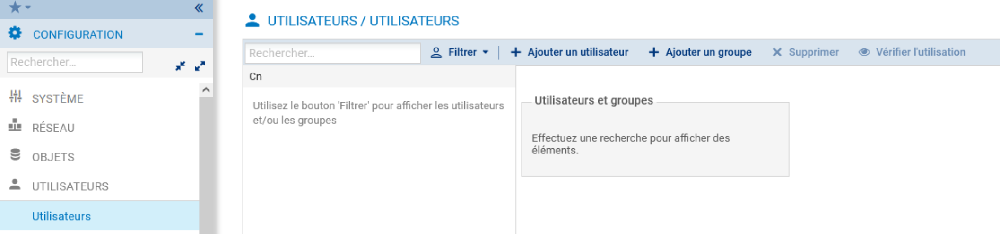
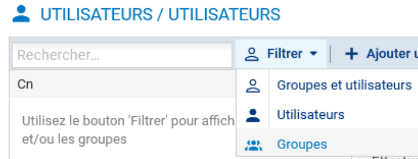
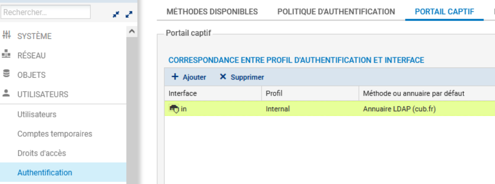
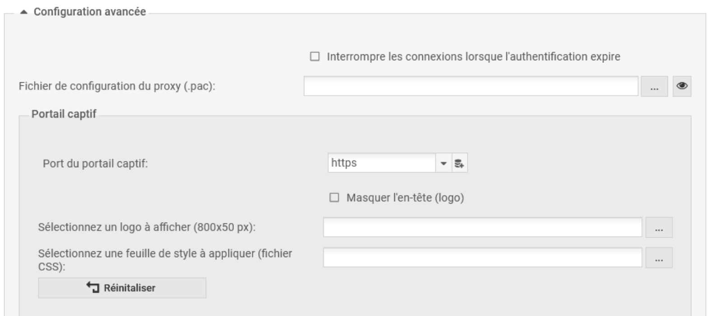
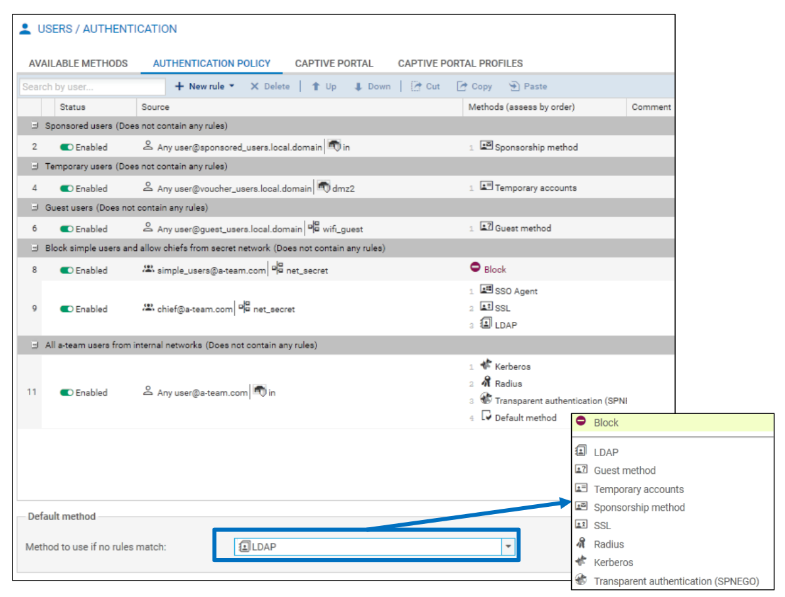
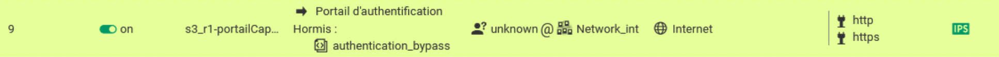

# Fiche 10 -- Utilisateurs, authentification et portail captif

La fonction d'authentification du pare-feu permet à l'utilisateur de
s'identifier via un login et un mot de passe ou de manière totalement
transparente (SSO / certificat). Pour cela, elle peut utiliser une base
de données LDAP (Lightweight Directory Access Protocol) et,
éventuellement, un certificat numérique x509.

Une fois l'authentification réussie, le login de l'utilisateur est
associé à la machine à partir de laquelle celui-ci s'est identifié (cela
est stocké dans la table utilisateur de l\'ASQ) et à tous les paquets IP
qui en proviennent, et ce pour la durée spécifiée par l'utilisateur ou
l'administrateur selon la méthode utilisée.

L'objectif est d'accorder aux utilisateurs des droits d'accès
spécifiques aux réseaux et aux services (portail captif, VPN SSL,VPN
IPsec, administration du firewall, etc.).

Les étapes de configuration sont les suivantes :

1\. Les annuaires stockent des informations de manière hiérarchisée dans
une arborescence. La norme LDAP permet l'organisation des données dans
l'annuaire et fournit un protocole d'interrogation de l'annuaire (RFC
4510), la configuration sur un pare-feu consiste à établir un lien vers
un ou plusieurs annuaires.

2\. Les utilisateurs sont stockés dans un annuaire et décrits par des
attributs (nom, prénom, identifiant, mot de passe, adresse e-mail,
certificat, etc.) utilisés par le pare-feu pour l'authentification.

3\. Les méthodes d'authentification utilisées permettent au pare-feu de
configurer la façon de vérifier l'identité des utilisateurs.

4\. La politique d'authentification permet d'accorder aux utilisateurs
des droits d'accès aux réseaux et services gérés par le pare-feu.

5\. Le portail captif peut avoir plusieurs usages : authentifier des
utilisateurs pour accéder au réseau, enrôler de nouveaux utilisateurs,
demander la création d'un certificat, télécharger le client VPN SSL et
sa configuration, faire une demande de parrainage pour accéder au
réseau, etc.

6\. La politique de sécurité contient les règles de filtrage nécessaires
pour que les utilisateurs inconnus soient redirigés vers la solution
d'authentification retenue (par exemple, via le portail captif).

!!! Info  "Info"
    En fonction de la méthode d'authentification retenue, certaines étapes
    de configuration seront facultatives.

## Liaison à un annuaire

Les pare-feu supportent quatre types d'annuaire qui peuvent être classés
en deux catégories.

Ils peuvent supporter cinq annuaires simultanément : un LDAP interne et 
quatre LDAP/AD externes, ou cinq LDAP/AD externes. Ce qui signifie
qu'ils peuvent supporter en même temps cinq domaines différents.

Un client LDAP intégré au pare-feu permet de se connecter à n'importe
quel type d'annuaire (interne ou externe) en utilisant le protocole LDAP
(ou LDAPS pour sécuriser les connexions avec les annuaires externes).

Dans le cas d'un LDAP interne, l'annuaire et les utilisateurs sont
automatiquement sauvegardés/restaurés avec la configuration du pare-feu.

Ajout et configuration d'un annuaire

-   Se rendre au menu **CONFIGURATION ⇒ UTILISATEURS ⇒ Configuration des
    annuaires**

-   Choisir le type d'annuaire ou Ajouter un annuaire (si un annuaire a
    déjà été configuré)

⇒ Un assistant de création se lance

### La configuration des annuaires externes 

Type d'annuaire: (Microsoft Active Directory,LDAP et LDAP de type PosixAccount) est sensiblement identique

-   Renseigner les paramètres du serveur à contacter :

    -    **Nom du domaine :** le nom DNS du domaine,
    -    **Serveur :** l'objet machine qui porte l\'adresse IP du serveur qui
héberge l'annuaire,
    -    **Port :** le port d'écoute de votre serveur LDAP
    -    **Domaine racine** (Base DN)

**Identifiant** (user DN) et le mot de passe :un compte administrateur
permettant au pare-feu de se connecter sur votre serveur LDAP et
d'effectuer des lectures/écritures sur certains champs. Il est
préférable de créer un compte spécifique pour le pare-feu et de lui
attribuer les droits uniquement sur les champs qui lui sont nécessaires.

**Haché du mot de passe :** permet de sélectionner l'algorithme de hachage
qui doit être utilisé pour enregistrer les mots de passes des
utilisateurs, ce qui évitera de l'enregistrer en clair.

Par la suite, l'assistant propose d'activer le profil d'authentification
0 (internal) sur une interface, dans le cas où le profil n'a pas déjà
été activé. Si c'est le cas, cette étape ne s'affiche pas.

!!! Warning  "Attention"
    L'activation du profil n'est pas obligatoire et pourra être réalisée (ou
    modifiée) ultérieurement (menu CONFIGURATION ⇒ UTILISATEURS ⇒
    Authentification ⇒ onglet PORTAIL CAPTIF ou onglet PROFILS DU PORTAIL
    CAPTIF pour modifier les paramétrages).

-   Renseigner ensuite Les paramètres de l'annuaire externe (voir la
    documentation en ligne pour le détail :
    <https://documentation.stormshield.eu/SNS/v4/fr/Content/User_Configuration_Manual_SNS_v4/Directory_configuration/DIRECTORY_CONFIGURATION_LDAP.htm>.)

### Configuration d'un annuaire interne

{width="11.658cm"
height="4.962cm"}

-    **Organisation :** le nom de l'organisation.

**Domaine **: le TLD (Top Level Domain) du domaine (fr, eu, org, com,
etc.).

-    **Mot de passe :** un mot de passe permettant de se connecter à
l'annuaire LDAP depuis un navigateur LDAP.

-    **Haché du mot de passe** : permet de sélectionner l'algorithme de
hachage qui doit être utilisé pour enregistrer les mots de passe des
utilisateurs, ce qui évitera de l'enregistrer en clair.

Par la suite, l'assistant propose d'activer le profil d'authentification
0 (internal) sur une interface, dans le cas où le profil n'a pas déjà
été activé. Si c'est le cas, cette option sera désactivée (grisée) et un
message indique que l'association entre profil d'authentification et
interface est déjà réalisée.

!!! Warning  "Attention"
    L'activation du profil n'est pas obligatoire et pourra être réalisée (ou
    modifiée) ultérieurement (menu CONFIGURATION ⇒ UTILISATEURS ⇒
    Authentification ⇒ onglet PORTAIL CAPTIF ou onglet PROFILS DU PORTAIL
    CAPTIF pour modifier les paramétrages).

Dans les options choisies ci-dessous (qui peuvent être modifiées par la
suite), le profil est créé. Les utilisateurs se connectant via
l'interface « in_vlan35_cli » auront accès à l'interface du portail
captif via l'URL : **https://(@IP_firewall \| FQDN_firewall)/auth**

-   **Activer l\'enrôlement des utilisateurs via le profil 0 (interne) du portail Web :** active le service d'enrôlement sur le profil 0
    (interne) permettant aux utilisateurs de remplir un formulaire de
    création de compte qui sera soumis à l'approbation de
    l'administrateur.
-   **Autoriser l'accès à la base LDAP :** donne la possibilité
    d'accéder à l'annuaire LDAP depuis une adresse IP publique via un
    navigateur LDAP. **Si cet accès n'est pas nécessaire, il est
    vivement conseillé de ne pas activer cette option.**

-   **Saisir un mot de passe** : permet de se connecter à l'annuaire, il
    est possible de le modifier.
-   **Activer l'utilisation de l'annuaire utilisateur :** cette option
    permet de démarrer le service LDAP.
-   Cliquer sur « Appliquer »

Les deux autres options permettent de :

-   **Activer l'accès non chiffré (PLAIN)** : active l'accès non chiffré
    à l'annuaire,
-   **Activer l'accès SSL** : active l'accès sécurisé à l'annuaire, il
    faut alors renseigner le champ certificat SSL présenté par le
    serveur,

Lorsqu'au moins un annuaire a été configuré, via « Action » il est
possible de :

-   supprimer un annuaire,
-   désigner un annuaire par défaut,
-   vérifier la connexion à l'annuaire,
-   vérifier l'utilisation de l'annuaire,

Le reste du menu liste tous les annuaires ajoutés, parmi lesquels
l'annuaire par défaut s'affiche en vert. En cliquant sur un annuaire,
ses paramètres s'affichent à droite de la page.

#### Gestion des utilisateurs

-   Se rendre au menu CONFIGURATION⇒ UTILISATEURS ⇒ Utilisateurs :

Création d'un utilisateur

Avec un LDAP interne (ou un LDAP externe accessible en
lecture/écriture), il est possible d'ajouter ou de supprimer des
utilisateurs et des groupes depuis le menu **CONFIGURATION ⇒
UTILISATEURS ⇒ Utilisateurs.**

-   Cliquer sur « Ajouter un utilisateur ».
-   Saisir les informations de l'utilisateur.
-   Saisir le mot de passe lorsqu'il est demandé.

⇒ L'utilisateur est créé : pour distinguer les annuaires, un suffixe est
ajouté aux utilisateurs et aux groupes pour indiquer le nom de
l'annuaire (et non pas le nom du domaine). Par exemple (<user@cub.fr>).

!!! Warning  "Attention"
    Lors de l'accès à ce menu, la liste des utilisateurs et groupes est
    toujours vide, c'est un comportement normal. En effet, si vous êtes
    connecté à un annuaire contenant un grand nombre d'utilisateurs et de
    groupes, l'affichage sans filtre dans le champ Recherche peut avoir un
    impact sur les performances de l'interface graphique. **Pour changer ce comportement par défaut (non conseillé) :** 
    Ouvrir le menu des préférences du pare-feu accessible en cliquant
    sur l'icône représentant des outils dans l'en-tête de l'interface
    Web, et cocher la case « Afficher les utilisateurs dès le démarrage
    du module ».

Sinon, pour voir les utilisateurs ou les groupes :

-   cliquer sur l'un des filtres (utilisateurs ou groupes)

### Le portail captif

Le portail captif, ou portail d'authentification, est une page web
embarquée sur le pare-feu et accessible via une connexion sécurisée
(HTTPS) depuis ses adresses IP (il peut être activé sur toutes les
interfaces du pare-feu).

Les utilisateurs peuvent se connecter sur le portail en utilisant leur
identifiant/mot de passe d'annuaire. Dans le cas où plusieurs annuaires
sont configurés au niveau du pare-feu, les utilisateurs peuvent ajouter
à l'identifiant le nom du domaine auquel ils appartiennent, par exemple,
user@cub.fr. Si le nom du domaine n'est pas précisé, l'authentification
s'effectuera avec la méthode ou avec l'annuaire défini par défaut au
niveau du profil d'authentification.

  ---------------------------------------------------------------------
  L'URL du portail est : https://(@IP_firewall \| FQDN_firewall)/auth
  ---------------------------------------------------------------------

#### Configuration du portail captif 

Pour activer le portail sur une interface, il suffit d'ajouter une ligne
dans cet encadré, sur laquelle il faut sélectionner une interface et un
profil d'authentification. Un seul profil peut être sélectionné par
interface.

-   Se rendre au menu CONFIGURATION ⇒ UTILISATEURS ⇒ Authentification ⇒
    onglet PORTAIL CAPTIF
-   Cliquer sur +Ajouter
-   Sélectionner l'interface, choisir le profil, puis « Appliquer »

La seconde partie de la page permet d'ajouter une charte d'utilisation
de l'accès réseau qui doit être acceptée par l'utilisateur une fois
authentifié ⇒ **Condition d'utilisation de l'accès à Internet. **Elle
peut être téléchargée en format PDF ou en format HTML. Le bouton
**Réinitialiser la personnalisation des conditions d'utilisation de
l'accès à Internet **permet de supprimer une charte préalablement
téléchargée.

La configuration avancée permet :

-   d'interrompre les connexions lorsque l'authentification expire,
-   d'importer un fichier de configuration du proxy (.pac),
-   de modifier le port du portail captif
-   de modifier son apparence : masquer le logo Stormshield sur le
    portail, télécharger un nouveau logo et modifier la feuille de
    style.

#### Configuration d'un profil d'authentification

-   Se rendre dans le menu C**ONFIGURATION ⇒ UTILISATEURS ⇒
    Authentification ⇒ onglet PROFILS DU PORTAIL CAPTIF.**

Il existe 10 profils différents, les cinq premiers sont préconfigurés :

-   internal, external : Ils possèdent la même configuration. Le premier
    est destiné à être attaché aux interfaces internes et le deuxième
    aux interfaces externes en utilisant n'importe quelle méthode
    d'authentification utilisant le portail captif ;
-   Guest : préconfiguré pour la méthode d'authentification invité ;
-   Voucher : préconfiguré pour la méthode d'authentification des
    comptes temporaires ;
-   Sponsor : préconfiguré pour la méthode d'authentification par
    parrainage.

Il faut configurer la méthode ou l'annuaire par défaut utilisé par le
profil sélectionné dans l'étape précédente. Par exemple :

-   Activer chaque profil pour consulter la pré-configuration (qu'il est possible de modifier).

#### Déconnexion des utilisateurs

##### Déconnexion depuis le navigateur

-   Se rendre au menu **CONFIGURATION ⇒ UTILISATEURS ⇒ Authentification
    ⇒ onglet PROFILS DU PORTAIL CAPTIF** (configuration avancée).

-   Cocher la case « Activer la page de déconnexion »

⇒ Un onglet de déconnexion s'ouvre dans le navigateur de l'utilisateur
ayant réussi à se connecter. Pour se déconnecter, l'utilisateur doit
simplement cliquer sur le bouton Déconnexion de cet onglet.

##### Déconnexion depuis le portail captif

Pour se déconnecter, l'utilisateur doit se connecter de nouveau au
portail captif, cliquer sur Connexion dans le menu de gauche et ensuite
sur le bouton Déconnexion.

Déconnexion d'un utilisateur depuis l'interface graphique par
l'administrateur

-   Se rendre au menu Supervision puis Utilisateurs.
-   Cliquer sur l'utilisateur avec le bouton droit, et ensuite sur
    Déconnecter l'utilisateur.

### Les méthodes d'authentification

Les firewalls SNS implémentent plusieurs méthodes d'authentification qui peuvent être
classées en deux catégories :

-   **les méthodes explicites via le portail captif :** l'utilisateur est
    redirigé vers le portail captif pour saisir un identifiant/mot de
    passe. Ces derniers sont récupérés par le pare-feu pour vérifier
    l'identité de l'utilisateur en fonction de la méthode utilisée ;
-   **les méthodes implicites ou transparentes :** l'authentification est
    transparente vis-à-vis de l'utilisateur qui n'a pas besoin de
    renseigner son identité explicitement pour accéder au réseau.

Pour ajouter une méthode d'authentification utilisées par le pare-feu

-   Se rendre au menu **CONFIGURATION ⇒ UTILISATEURS ⇒ Authentification
    ⇒ onglet MÉTHODES DISPONIBLES**.

Chaque méthode nécessite de renseigner des paramètres spécifiques.
**Cependant, suite à la configuration d'un annuaire LDAP, la méthode
d'authentification LDAP est renseignée automatiquement.**

### La politique d'authentification

Puisque les pare-feu SNS supportent plusieurs annuaires et plusieurs
méthodes d'authentification simultanément, il peut être nécessaire de
définir une politique d'authentification pour indiquer la ou les
méthodes à appliquer en fonction de deux critères : l'utilisateur ou le
groupe d'utilisateurs, et l'adresse IP source ou l'interface d'entrée.

-   **Se rendre au menu CONFIGURATION ⇒ UTILISATEURS ⇒ Authentification
    ⇒ onglet POLITIQUE D'AUTHENTIFICATION**.

La politique peut être constituée de plusieurs règles appliquées en
fonction de leur ordre. Plusieurs méthodes d'authentification peuvent
être utilisées par une seule règle. Dans ce cas, les méthodes sont
appliquées suivant l'ordre d'apparition dans la règle. Si une méthode
permet d'authentifier l'utilisateur, les méthodes suivantes ne seront
pas testées. Par exemple :

Dans la règle 3, tous les utilisateurs du domaine « institute.com » qui
se connectent depuis le réseau interne doivent, en premier lieu,
s'authentifier via la méthode Agent SSO. Si l'authentification échoue,
alors on propose à l'utilisateur de sélectionner son certificat. Enfin,
si cette seconde méthode n'aboutit pas (pas de certificat pour cet
utilisateur par exemple), il est convié à renseigner un couple
d'identifiant/mot de passe pour une authentification via la méthode
LDAP.

Dans le cas où aucune règle ne correspond aux critères du trafic, la
méthode d'authentification par défaut est appliquée.

Lorsqu'elle est utilisée dans une règle, la méthode Agent SSO est
automatiquement la plus prioritaire des méthodes parce que cette
dernière authentifie l'utilisateur sur le pare-feu dès son
authentification sur le domaine Active Directory.

Dans la politique d'authentification, vous pouvez donc créer une
politique pour déterminer les réseaux et les utilisateurs qui
utiliseront la méthode LDAP, ou la définir comme la méthode par défaut.

Pour créer une politique

-   Cliquer sur **Nouvelle règle ⇒ Règle Standard.**

-   Renseigner les utilisateurs ou les groupes,
-   Renseigner les réseaux ou les interfaces sources. Dans le cas de la
    création d'un premier annuaire, le rattachement du profil
    d'authentification 0 (internal) à une interface est proposé lors de
    la création de l'annuaire. Sinon le rattachement peut s'effectuer
    dans le menu CONFIGURATION ⇒ UTILISATEURS ⇒ Authentification ⇒
    PORTAIL CAPTIF, en ajoutant une entrée dans la liste CORRESPONDANCE
    ENTRE PROFIL D'AUTHENTIFICATION ET INTERFACE. Dans l'entrée, il faut
    sélectionner l'interface et le profil. La méthode ou l'annuaire par
    défaut sont renseignés automatiquement en fonction de ce qui est
    configuré sur le profil sélectionné.
-   Choisir les méthodes d'authentification à utiliser (kerberos,
    Radius, SSL, SPNEGO, Agent SSO, méthode par défaut et interdire).

### Règles de filtrage pour l'authentification

??? Info  "Rappel du principe du portail captif"
    1\. L'utilisateur ouvre un navigateur pour accéder à un site en HTTP ou
    HTTPS. 
    2\. La requête HTTP est interceptée par le firewall qui renvoie
    l'utilisateur vers le portail d'authentification
    (https://@IP_firewall/auth). 
    3\. L'utilisateur introduit son identifiant/mot de passe d'annuaire qui
    sont envoyés au firewall via une connexion sécurisée (HTTPS). 
    4\. Le firewall authentifie l'utilisateur au niveau de l'annuaire (LDAP
    interne/externe ou AD). Dans le cas où l'utilisateur est authentifié, le
    navigateur est renvoyé vers le site web demandé au départ.

Le premier point nécessite une règle pour permettre à un utilisateur non
authentifié à être redirigé vers le portail ⇒ Le pare-feu doit rediriger
les requêtes HTTP et HTTPS des utilisateurs non authentifiés vers le
portail captif.

-   Cliquer sur **Nouvelle règle** puis **règle d'authentification**

Un assistant permet de créer une règle par défaut qu'il sera possible de
modifier :

Ci-dessous la règle modifiée pour rediriger tous les flux HTTP et HTTPS
provenant des réseaux protégés vers le portail captif :

Le champ Utilisateur permet de spécifier l'utilisateur (ou le groupe) devant
être authentifié pour que la règle s'applique dont :

-    **Any user@any** : désigne tout utilisateur authentifié, quel que soit
l\'annuaire ou la méthode d\'authentification utilisés,

-   **Any user@guest_users.local.domain** : désigne tout utilisateur
authentifié par la méthode invité,

-   **Any user@voucher_users.local.domain** : désigne tout utilisateur
authentifié par la méthode comptes temporaires,

-   **Any user@sponsored_users.local.domain** : désigne tout utilisateur se
présentant via la méthode parrainage,

-   **Any user@\<domaine\>** : désigne tout utilisateur authentifié par
l'annuaire du domaine,

-   **Any user@none** : désigne tout utilisateur authentifié par une méthode
n'utilisant pas un annuaire, par exemple : parrainage, compte
temporaire, etc.

-    **Utilisateurs inconnus :** désigne tout utilisateur non authentifié.
Cette valeur est principalement utilisée dans une règle
d'authentification car dans une telle règle, on ne connaît pas encore
l'utilisateur.

**La liste de tous les utilisateurs et groupes présents dans les annuaires**.

!!! Warning  "Avant d'ajouter la règle précédente de redirection vers le portail captif, il faut s'assurer que:"
    les connexions DNS sont autorisées pour tous les utilisateurs
    (authentifiés ou non), car sans résolution DNS, il n'y aura pas de
    requêtes HTTP ou HTTPS et par conséquent, pas de redirection vers le
    portail captif. 
    La règle d'activation du proxy SSL doit également être placée avant
    pour pouvoir accéder aux sites en HTTPS.

Vous pouvez ensuite ajouter des règles spécifiques pour les utilisateurs
ou les groupes authentifiés (Source \> Utilisateur:).

La connexion via le portail captif avec Firefox :

Une fois connectée, l'accès à Internet est possible.
