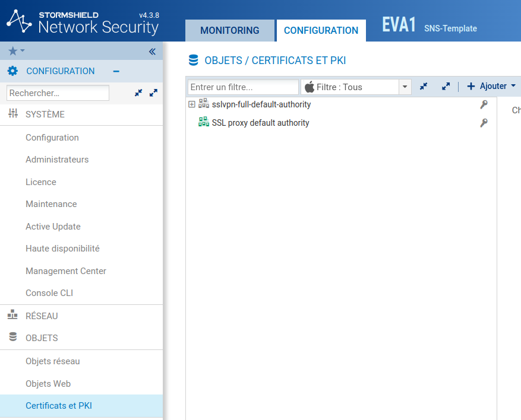
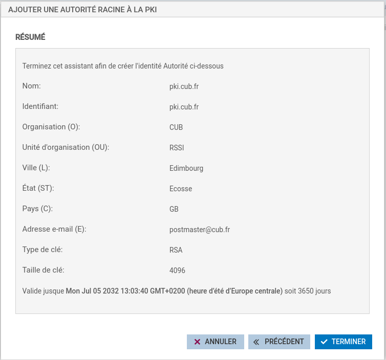
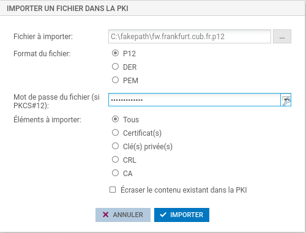
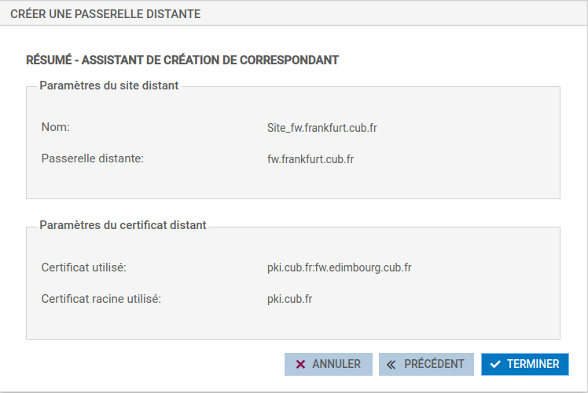
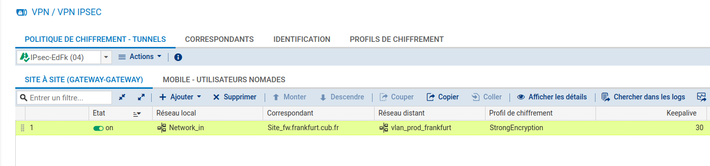
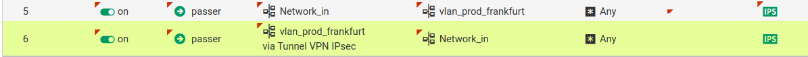

# Fiche 13 -- VPN site à site

## Le VPN IPSec

### Concepts et généralités

Le tunnel VPN IPsec site-à-site permet de connecter deux réseaux privés
via un réseau public tout en assurant les services de sécurité suivants :

-   l**'authentification** : permet la vérification des identités des
    deux extrémités de tunnel. Deux méthodes d'authentification sont
    possibles : clé pré-partagée (PSK : Pre-Shared key) ou certificats
    (PKI : Public Key Infrastructure) ;
-   l**'intégrité** : vérifie que les données n'ont pas été modifiées en
    utilisant les algorithmes de hachage ;
-   l**a confidentialité** : assure que les données ne peuvent être lues
    par une personne tierce capturant le trafic ;
-   l**'anti-rejeu** : permet d'ignorer des anciens paquets (des
    paquets dont le numéro de séquence est antérieur à un certain seuil)
    déjà reçus, s'ils sont transmis à nouveau.

La négociation du tunnel entre les deux extrémités s'effectue avec le
protocole **ISAKMP** (Internet Security Association Key Management
Protocol) appelé aussi IKE dont la dernière version se nomme IKEv2.

Une fois le tunnel établi entre les deux équipements, les extrémités de
trafic correspondantes aux réseaux privés peuvent communiquer via le
protocole ESP (Encapsultating Security Payload) qui assure la
confidentialité et l'intégrité des données échangées. Le protocole ESP
est encapsulé directement dans un datagramme IP.


!!! danger "Important "
    Dans le respect des bonnes pratiques, il est recommandé d'utiliser le
    protocole **IKEv2** pour la mise en œuvre du tunnel et une
    authentification forte par **certificats X509**.

    Vous pouvez bien evidement commencer par un premier test avec une Shared Key (clé partagé) aux deux extermités du tunnel.


**Phase 1 :** Les deux extrémités du tunnel négocient un profil de
chiffrement phase 1 et s'authentifient avec un clé pré-partagée ou des
certificats X509. Un dialogue d'application chiffré nommé PARENT-SA
permet ensuite de démarrer la négociation de la phase 2. Si les deux
extrémités n'arrivent pas à se mettre d'accord sur un profil de
chiffrement ou à s'authentifier, la négociation s'arrête immédiatement.

**Phase 2 :** Les deux extrémités vont négocier le profil de chiffrement
de la phase 2 et les extrémités de trafic qui permettront la
communication à travers le tunnel. Deux canaux sont ouverts pour le
transmission des données, un pour chaque direction. Chaque canal utilise
sa propre clé de chiffrement appelée CHILD-SA1 et CHILD-SA2. Chaque
extrémité possédera donc deux clés symétriques, une pour chiffrer les
données à envoyer et l'autre pour déchiffrer les données reçues dans
l'autre canal.

!!! danger "Attention "
    Les tunnels IPSec sont générallement monté sur des routeurs ayant des **IP Publiques**. 
    Quand le Tunnel doit être monté sur des routeurs "cachés" derrière du NAT, il faut configurer ce qu'on appelle communément le NAT-T (NAT Traversal)

### Configurer le service VPN IPSec

L'authentification lors de la création d'un tunnel VPN IPSec peut se
faire de deux façons :

-   par la définition d'une **clé pré-partagée commune** ;
-   par l'utilisation de **certificats X509** créés pour chaque extrémité à
    l'aide d'une PKI (Infrastructure à clés publiques utilisant une
    autorité de certification).

L'utilisation de la clé pré-partagée est déconseillée en production et
valable uniquement lors de phase de tests ou du maquettage. Nous
choisirons ici l'authentification par certificats.

#### Gestion de la PKI du SNS

Dans un premier temps, il est donc nécessaire de créer une PKI sur l'un
des pare-feux puis de créer des certificats serveurs pour chaque
extrémité du tunnel (ex : un certificat pour le pare-feu de edimbourg et
un certificat pour le pare-feu de frankfurt).

Cliquer sur Configuration \> Objets \> Certificats et PKI



Puis sur Ajouter \> Autorité racine




Une fois la nouvelle PKI créée, il est nécessaire de générer 2
certificats pour les 2 pare-feux concernés. Pour cela, sélectionner la
PKI pki.cub.fr et cliquer sur Ajouter \> Identité serveur afin de créer
un certificat pour le pare-feu d'Edimbourg.


Il faut ensuite réaliser la même opération afin de créer un certificat
pour le pare-feu de Frankfurt en adaptant certains paramètres dont en
particulier le CN (Common Name) du certificat.

Nous avons maintenant à notre disposition une PKI et 2 certificats
générés.


Comme la PKI a été créée sur le pare-feu d'Edimbourg, il est nécessaire
d'exporter le certificat du pare-feu de Frankfurt sur le pare-feu de
l'agence de Frankfurt.

Pour cela, clique droit sur le certificat concerné puis Télécharger \>
Identité \> au **format P12**. Il est demandé d'entrer un mot de passe qui
permettra de protéger votre clé privée en particulier en cas de vol ou
de compromission.

??? Info "Format P12"
    Certificat **P12** (PKCS#12)<br/>
    - **Encodage** : Le format **P12** est encodé en **binaire**.<br/>
    - **Structure** : C'est un conteneur binaire qui peut stocker à la fois des certificats, des clés privées et même des chaînes de certificats (certificats intermédiaires et racine).<br/>
    - **Utilisation** : Le format **P12** est utilisé pour transporter à la fois un certificat et sa clé privée dans un seul fichier, souvent pour les besoins d'import/export (ex. : sur les navigateurs, serveurs ou clients).<br/>
    - **Extension de fichier** : Les fichiers **P12** ont souvent l'extension `.p12` ou `.pfx`.<br/>
    - **Sécurité** : Le fichier **P12** peut être protégé par un mot de passe pour sécuriser les clés privées qu'il contient.<br/>
    - **Lisibilité** : Non lisible en texte brut, car c'est un fichier binaire. Il doit être ouvert avec des outils spécialisés (comme `OpenSSL` ou les gestionnaires de certificats dans les systèmes d'exploitation).


Une fois le fichier p12 téléchargé sur le poste, il est nécessaire de
l'importer dans l'autre pare-feu en l'occurence celui de Franckfurt.
Pour cela, se connecter sur l'interface d'administration du pare-feu
concerné en s'assurant de disposer du fichier p12 sur le poste client
d'administration.

Puis cliquer sur Configuration \> Objets \> Certificats et PKI puis sur
Ajouter \> Importer un fichier.




#### Configuration du VPN IPSEC

Maintenant que chaque pare-feu dispose de son certificat signé par la
PKI précédemment créée, il s'agit de configurer le tunnel VPN IPSEC sur
les deux extrémités.

Sur le pare-feu de Edimbourg, cliquer sur Configuration \> VPN \> VPN
IPsec et choisir la politique IPsec 04 (04) qu'il faudra renommer
IPsec-EdFk.


Puis cliquer sur Ajouter \> Tunnel site à site simple.

Un assistant s'ouvre et permet de définir quel sous-réseau ou VLAN de
votre agence (ici Edimbourg) pourra envoyer et recevoir des flux par le
tunnel VPN IPSec jusqu'à l'autre agence (ici Frankfurt). Ainsi, en
ressources locales, indiquer le sous-réseau ou le VLAN présent dans
votre agence (si vous souhaitez permettre la communication de plusieurs
sous-réseaux, il faut au préalable créer un objet groupe contenant
l'ensemble des sous-réseaux concernés).

En réseaux distants, vous indiquerez un objet réseau correspondant au
sous-réseau à joindre dans l'autre agence. Enfin, il sera indispensable
de définir un correspondant et de le sélectionner.


!!! Warning "Attention"
    **Attention ! Cette étape peut porter à confusion**. Bien que le terme
    « identification du correspondant » soit employé ici, c'est bien le
    certificat du pare-feu sur lequel vous êtes connecté (ici pare-feu
    Edimbourg) qu'il faut indiquer et non celui du pare-feu distant.






Lorsque la création du tunnel IPSec est effective, il faut bien
évidemment l'activer (on) **et définir une valeur en seconde de
Keepalive (vous veillerez à définir la même valeur sur le pare-feu
distant, ici, Frankfurt)**. Cela permettra de faciliter l'activation du
tunnel et assurera le maintien de ce dernier même en cas d'absence de
trafic à l'intérieur de celui-ci (lire l'explication ci-dessous).

!!! Info "KeepAlive"
    L'option supplémentaire **Keepalive** permet de maintenir les
    tunnels montés de façon artificielle. Cette mécanique envoie des paquets
    initialisant et forçant le maintien du tunnel. Cette option est
    désactivée par défaut pour éviter une charge inutile, dans le cas de
    configuration contenant de nombreux tunnels, montés en même temps sans
    réel besoin.

**Pour activer cette option**, affectez une valeur suppérieur à  0,
correspondant à l'intervalle en seconde, entre chaque envoi de paquet
UDP.

### Mise en œuvre des règles de filtrage adaptées

Pour que la communication par l'intermédiaire de ce tunnel IPsec soit
pleinement fonctionnel, il est nécessaire de créer les règles de
filtrage permettant d'autoriser la création du VPN puis la communication
entre les sous-réseaux distants.

Toujours sur le pare-feu de l'agence d'Edimbourg, il faut autoriser
l'établissement du tunnel (protocoles ISAKMP et ESP) entre les deux
pare-feux. Normalement, une règle implicite est prévue à cet effet,
cependant lors de différentes phases de test, cela s'est avéré peu
concluant, ce qui nous amène à proposer des règles explicites à ce
sujet.


Enfin, il faut définir les règles nécessaires autorisant la
communication des sous-réseaux définis dans la configuration du tunnel
au niveau des règles de filtrage.



La directive « via Tunnel VPN IPsec » dans la seconde règle est très
importante et obligatoire. Il est possible de la définir lors de la
création de la règle dans le menu Source \> Configuration avancée \>
Via : Tunnel VPN IPSec.

À partir de là, **il s'agira de réaliser exactement les mêmes opérations
dans le sens inverse sur le pare-feu de l'autre agence (ici Frankfurt)**
afin de rendre le tunnel pleinement opérationnel.

!!! Danger "Nota Bene"
    **NB :** La plupart des erreurs rencontrées proviennent de différences
    de configuration entre les deux extrémités du tunnel (Profil de
    chiffrement utilisé, Keepalive, définition des sous-réseaux habilités à
    solliciter le tunnel VPN, etc). Il s'agit donc de faire preuve de
    rigueur et d'attention sur ces éléments en particulier.


## Gestion du NAT-Traversal (NAT-T)

Lorsque vous montez un tunnel IPSec entre deux équipements Stormshield, ces équipements vont chiffrer les paquets et les encapsuler dans le protocole **ESP (Encapsulating Security Payload)**, qui est un protocole de la suite IPSec.

Problème :
Les routeurs Cisco situés entre les deux équipements effectuent du NAT (Network Address Translation). Le NAT pose un problème avec ESP, car :

- ESP est un protocole IP (“protocol 50”) et ne possède pas de numéro de port. Cela pose un problème avec le NAT (Network Address Translation) (comme avec TCP ou UDP).
- Le NAT modifie les adresses IP : Cela casse l’intégrité du paquet IPSec, car les équipements IPSec vérifient l’intégrité des paquets (checksum + hash) et détectent toute modification comme une attaque.

Solution : **NAT-Traversal (NAT-T)**
Pour contourner ce problème, on encapsule les paquets ESP dans de l'UDP/4500.

Voici les étapes du NAT-T :

-   Détection du NAT : Lors de la phase d’établissement du tunnel IPSec (IKE), les équipements Stormshield et Cisco échangent des messages pour détecter s’il y a un NAT entre eux.
-   L’usage du NAT-T provoquera l’ajout d’un en-tête UDP de 8 octets.
-   Encapsulation ESP dans UDP/4500 : Une fois le NAT détecté, les paquets ESP sont encapsulés dans des paquets UDP, port 4500, ce qui permet au NAT de fonctionner correctement.
-   Décapsulation : À la réception, l’équipement IPSec retire l’en-tête UDP et traite normalement le paquet ESP.


!!! Danger "Important"
    **NB :** Certains routeurs supportent l'autodetection de NAT-T, dautres non. Il faut evidement s'adapter au materiel utilisé. Nos vieux routeurs ne le supporte pas.

Si l'équipement supporte nativement NAT-T il suffit de l'activer. 
Exemple sur un équipement cisco:

````bash
crypto isakmp nat-traversal 20  #Le 20 correspond au délai en secondes pour détecter un NAT.
````

Dans le cas contraire, il faut forcer l'activation du NAT-T sur le firewall (Stromshield en l'occurence). et bien configurer la redirection du port UDP 4500 (pour ikeV2). Le port UDP 500 était autrefois utilisé pour IKEv1.

````bash
    ! Activer la redirection des ports UDP 4500 (NAT-T)
ip nat inside source static udp 192.168.1.1 4500 interface GigabitEthernet0/0 4500
````