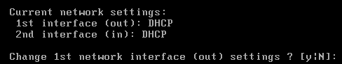

# Fiche 01 -- Initialiser un Pare-feu SNS

## Procédure de remise à zéro des pare-feu SNS

Cette procédure ne doit évidemment être déroulée que sur un SNS qui aurait déjà été configuré.

Un RAZ du pare-feu peut être fait via la console (sur les VM ou les
boitiers physiques), ceci nécessite un redémarrage (reboot). **Sur les
boîtiers physiques **: un appui sur le bouton *reset* pour les boîtiers
physiques permet de restaurer la configuration d'usine et redémarrer en
bridge sur toutes les interfaces.

Vous pouvez faire le choix de réinitialiser un boitier physique via
l'accès console. Pour cela, installer le driver du câble console sur
Windows : <https://ftdichip.com/drivers/vcp-drivers/>.

Lancer un logiciel permettant l'accès console (Putty, Teraterm, minicom) et
utilisant en débit **115200**.


**Sur une VM :**

-   démarrer (ou redémarrer) la machine virtuelle et s'authentifier pour
    accéder à la console en administrateur ;
-   saisir la commande 

```Bash
defaultconfig --f --r --p --c -L
```                                                                                                                                                                  

## Configuration initiale

La configuration d'usine par défaut du *pare-feu SNS * est la suivante.

Dans une configuration usine, notamment pour les machines virtuelles et
les modèles SN310, la première interface **(1) **du pare-feu SNS
physique est nommée « **OUT »**, la seconde « IN » et le reste des
interfaces « DMZx ». L'interface « OUT » est une interface **externe**,
utilisée pour connecter le pare-feu SNS à internet et le reste des
interfaces sont **internes** et servent principalement à connecter le
pare-feu SNS à des réseaux locaux.

??? Warning "Attention"
    **Attention au brassage !** La distinction **interne/externe** pour les interfaces permet de se protéger contre les attaques d'usurpation d'adresse IP **IPSpoofing**.


Le schéma présenté ci-dessous correspond, quant à lui, à un boîtier
SN210. Comme vous pouvez le constater, l'organisation des interfaces est
différente de celle des machines virtuelles ou des modèles SN310 et
supérieur.


Pour initialiser le pare-feu, il faut se brancher sur l'interface **IN**.

En configuration usine, sur un **boîtier physique** de type SN210 ou SN310, **toutes les interfaces sont incluses dans un bridge** dont
l'adresse est 10.0.0.254/8. Sur les **boîtiers** **physiques**, un serveur DHCP est actif sur toutes les interfaces du bridge et il
distribue des adresses IP comprises entre 10.0.0.10 et 10.0.0.100. L'accès à l'interface web de configuration du pare-feu SNS se fait avec
l'url : **https://10.0.0.254/admin.**

-  Sur le boîtier

Par défaut, seul le compte système **admin **(mot de passe par défaut
**admin**), disposant de tous les privilèges sur le boîtier, existe et
peut se connecter.

-  Sur une VM

La configuration usine lance un dialogue de pré-configuration qui
demande de changer le mot de passe par défaut, de configurer vos
interfaces, le clavier de la console, etc :

Un premier écran propose un choix qu'il n'est pas nécessaire de valider,
le système continue automatiquement :


Un premier redémarrage automatique est fait et la configuration continue :


-   Sélectionner 4 pour fr (sur le clavier le chiffre 4 sans utiliser la
    touche Maj).


-   Saisir un mot de passe de 8 caractères minimum avec Maj/min/chiffre/caractères spéciaux.


Passons à la configuration des interfaces réseau :



Même si plusieurs interfaces ont été ajoutées sur l'hyperviseur
(Proxmox, VirtualBox ou VmWare), seulement 2 sont modifiables via
l'assistant du démarrage.

Les interfaces peuvent être laissées en DHCP ou être configurées via une
adresse IP fixe.

!!! Success "Vérifications"
    Sachant qu'il est déconseillé d'administrer le pare-feu via l'interface
    **OUT**, l'idée est de configurer l'interface **IN** de manière à ce qu'elle
    se trouve connectée à un réseau logique sur lequel est également
    connecté (ou peut être connecté) un poste de travail permettant de
    procéder à l'administration du Stormshield.


Lors de cette configuration, le paramétrage pourra être, bien sûr,
modifiée et, par exemple, une autre interface pourra être dédiée à
l'administration, nottament via l'usage d'un **vlan de management**

Pour ce premier démarrage

-   Laisser l'interface **OUT** en DHCP même si aucun serveur DHCP n'est
    relié au réseau ⇒ répondre « n » ou E
-   Laisser l'interface **IN** en DHCP uniquement s'il y a un serveur
    DHCP sur le réseau sinon répondre « y » pour mettre une adresse IP
    accessible via le réseau. Par exemple :


Répondre « n » sur la dernière question, en effet il n'est pas
recommandé d'autoriser l'administration sur votre interface **OUT**.


Votre système est installé avec les valeurs rappelées ci-dessus, vous
pouvez tester que la configuration du clavier a bien été prise en compte
en saisissant votre login/mdp.


L'interface d'administration est accessible à l'adresse
https://@IP-IN/admin/ à partir d'un poste sur le même réseau.

Basculer sur la fiche n°2 pour une première configuration du boîtier ou
de la VM.

!!! info "Plus d'informations"
    https://documentation.stormshield.eu/SNS/v4/fr/Content/Software_Recovery_via_USB_key/SN150-SN160-SN160W-SN210-SN210W-SN310.htm