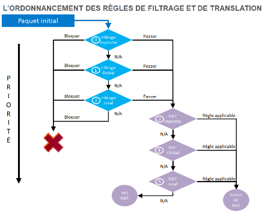
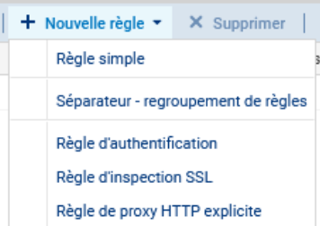
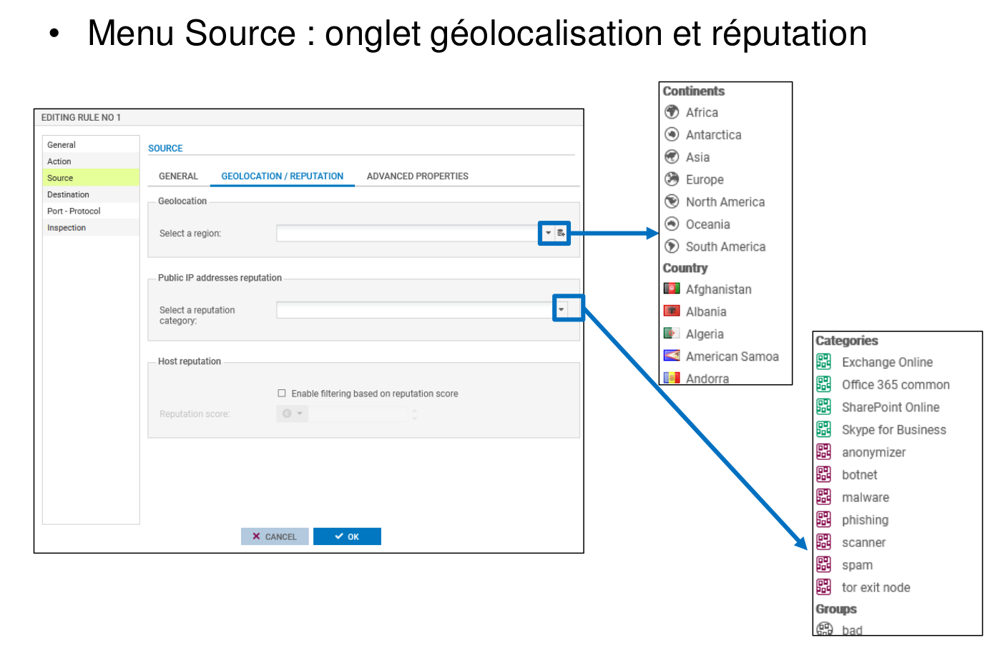

# Fiche 07-- Filtrage protocolaire

La mise en place d'une politique de filtrage, permet à l'administrateur
de définir les règles qui permettront d'autoriser ou de bloquer les flux
au travers du pare-feu SNS. Selon les flux, certaines inspections de
sécurité (analyse antivirale, analyse antispam, filtrage URL, etc.)
peuvent être activées (nous détaillerons ces analyses dans la fiche 7
« Filtrage applicatif »). Les règles de filtrage définies doivent
respecter la politique de sécurité de l'entreprise.

## Présentation des fonctionnalités

Pour définir un flux, une règle de filtrage se base sur de nombreux
critères ; ce qui offre un haut niveau de granularité. Parmi ces
critères, il est notamment possible de préciser :

-   l'adresse IP source et/ou destination ;
-   la réputation et la géolocalisation de l'adresse IP source et/ou
    destination ;
-   l'interface d'entrée et/ou sortie ;
-   l'adresse réseau source et/ou destination ;
-   le FQDN source et/ou destination ;
-   la valeur du champ DSCP ;
-   le service TCP/UDP (n° de port de destination) ;
-   le protocole IP (dans le cas d'ICMP, le type de message ICMP peut
    être précisé) ;
-   l'utilisateur ou le groupe d'utilisateurs devant être authentifié.

Le nombre de règles de filtrage actives dans une politique est limité.
Cette limite dépend exclusivement du modèle de pare-feu SNS.

Le premier paquet appartenant à chaque nouveau flux reçu par le pare-feu
est confronté aux règles de filtrage de la première à la dernière ligne.
Il est donc recommandé d'ordonner au mieux les règles de la plus
restrictive à la plus généraliste.

**Par défaut, tout trafic qui n'est pas autorisé explicitement par une
règle de filtrage est bloqué** (règle n° 3 de la politique de sécurité
« Block all »).

Dans les recommandations pour la définition d'une politique de filtrage
réseau d'un pare-feu publiées par l'ANSSI le 30 mars 2013, il est
précisé que la règle finale qui consiste à bloquer et journaliser tout
ce qui n'est pas autorisé par les règles précédentes doit apparaître
explicitement à la fin de la politique de filtrage appliquée. L'ajout de
cette règle explicite garantit l'application du modèle de sécurité
positif (tout ce qui n'a pas été autorisé précédemment est interdit) et
permet de s'assurer que la trace des flux non légitimes est conservée.

Les pare-feu SNS utilisent la technologie SPI (Stateful Packet
Inspection) qui leur permet de garder en mémoire l'état des connexions
TCP (et SCTP) et des pseudo-connexions UDP et ICMP afin d'en assurer le
suivi et de détecter d'éventuelles anomalies ou attaques. La conséquence
directe de ce suivi « Stateful » est l'autorisation d'un flux par une
règle de filtrage uniquement dans le sens de l'initiation de la
connexion : les réponses faisant partie de la même connexion sont
automatiquement autorisées. Ainsi, nous n'avons nul besoin d'une règle
de filtrage supplémentaire pour autoriser les paquets réponse d'une
connexion établie au travers du pare-feu.

La figure page suivante présente l'ordre d'application des règles de
filtrage et de NAT.

!!! Info  "Information importante"
    il est important de noter que les paquets sont filtrés **avant** que la
    phase de traduction (NAPT).

Le premier paquet reçu est confronté aux règles de filtrage des
différents niveaux suivant l'ordre présenté dans la figure ci-après. Dès
que les éléments du paquet correspondent à une règle dans un niveau,
l'action de la règle (bloquer ou autoriser) est appliquée et le paquet
n'est plus confronté aux règles suivantes. Si aucune règle de filtrage
ne correspond, **le paquet est bloqué par défaut**.

**Dans le cas où le paquet est autorisé**, il est confronté aux règles
de NAT des différents niveaux toujours suivant l'ordre présenté
ci-après.

-   **Le filtrage implicite **regroupe les règles de filtrage
    pré-configurées ou ajoutées dynamiquement par le pare-feu pour
    autoriser ou bloquer certains flux après l'activation d'un service.
    Par exemple, une règle implicite autorise les connexions à
    destination des interfaces internes du pare-feu SNS sur le port
    HTTPS (443/TCP) afin d'assurer un accès continu à l'interface
    d'administration Web. Autre exemple, dès l'activation du service
    SSH, un ensemble de règles implicites sera ajouté pour autoriser ces
    connexions depuis toutes les machines des réseaux internes.
-   **Le filtrage global **regroupe les règles de filtrage injectées au
    pare-feu depuis l'outil d'administration « Stormshield Management
    Server » (SMC) ou après affichage des politiques globales.
-   **Le filtrage local **représente les règles de filtrage ajoutées par
    l'administrateur depuis l'interface d'administration du pare-feu
    SNS.

Les règles implicites sont accessibles depuis le menu **CONFIGURATION
/** **POLITIQUE DE SÉCURITÉ /** **Règles implicites**. Chaque règle peut
être activée/désactivée.

!!! Warning  "Information importante"
    Ouvrir le menu **Configuration** / **Politique de sécurité** / **Règles
        implicites**.

!!! Danger  "Information importante"
    La modification de l'état de ces règles a un impact direct sur le
    fonctionnement des services du pare-feu. Pour que le service concerné
    fonctionne toujours, il faut s'assurer au préalable que le flux est
    autorisé par les règles de priorité moindre telles que globales ou
    locales.

## Analyse des politiques prédéfinies de filtrage

Vous allez dans un premier temps découvrir à travers les règles déjà
définies dans les deux premières politiques prédéfinies de filtrage, le
fonctionnement des règles de filtrage sur un pare-feu Stormshield.

-   Ouvrir le menu **Configuration** / **Politique de sécurité** /
    **Filtrage et NAT **/ **Filtrage**
-   Dans la liste déroulante des politiques de sécurité, choisir**(1)
    Block all**.

Cette politique bloque presque tous les flux (règle N°3) sauf ceux
définis par les règles 1 et 2.

-   **La règle numéro 1** autorise l'accès en **https** et sur le port
prédéfini **1300 pare-feu_srv **à toutes les interfaces du pare-feu,
elle permet donc l'administration à distance depuis n'importe quel
réseau.

-    **La règle numéro 2** autorise les requêtes **ICMP Echo** vers toutes
les interfaces du pare-feu, afin de pouvoir vérifier la présence du
pare-feu à l'aide des commandes ICMP. *Attention : un ping vers la
passerelle par défaut échoue, car il n'est pas explicitement autorisé.*

-   Dans la liste déroulante des politiques de sécurité, choisir **(2)
    High**.

Cette politique est un peu moins restrictive que la précédente, elle
autorise plus de chose à partir des réseaux internes.

-   **La règle numéro 1** autorise l'accès à des services web en **http,
https, dns ⇒ **elle permet l'accès à des sites web.

-    **La règle numéro 2** autorise l'accès à des services **ftp.**

-    **La règle numéro 3** autorise l'accès à des services de messagerie en
-    **imap,** **smtp, pop3** elle permet l'envoi et la réception de
messages.

-    **La règle numéro 4** autorise les requêtes **ICMP Echo** vers n'importe
quelle destination des réseaux internes, afin de pouvoir vérifier la
présence du pare-feu et des services en DMZ à l'aide des commandes
ICMP.* Attention : un ping vers la passerelle par défaut échoue car il
n'est pas explicitement autorisé.*

!!! Warning  "Information importante"
    Vous remarquerez que pour toutes ces règles la colonne
    « Inspection de sécurité » stipule **IPS(Intrusion Prevention System)
    **qui est le niveau le plus élevé de filtrage avec inspection du contenu
    et le cas échéant blocage si l'on suspecte un comportement anormal ou
    une tentative d'intrusion.

## Création d'une règle de filtrage

### Principes généraux

Les règles de filtrage s'intègrent dans une politique de filtrage. Il
est possible de modifier une politique existante puis de l'appliquer.
Vous pouvez utiliser une politique qui contient déjà des règles ou non
comme la politique n°5.

!!! Info  "Information"
    À noter qu'il est possible de copier/coller des politiques de sécurité
    et des règles que l'on modifie éventuellement ensuite.

Pour renommer la politique :

-   Cliquer sur **Editer** puis **Renommer**
-   Modifier le nom et cliquer sur **METTRE À JOUR**

-   Ouvrir le menu **Configuration** / **Politique de sécurité** /
    **Filtrage et NAT **/ **Filtrage**

L'onglet **FILTRAGE** est composé d'un en-tête pour la gestion des
règles de filtrage :

-   **Règle simple** : ajoute une règle de filtrage standard. Par
    défaut, une nouvelle règle est désactivée et tous ses critères sont
    paramétrés à **Any**.
-   **Séparateur -- regroupement de règles :** ajoute un séparateur qui
    regroupe toutes les règles se trouvant au-dessous (ou jusqu'au
    prochain séparateur). Cela permet de faciliter l'affichage d'une
    politique contenant un nombre de règles important. Le séparateur
    peut être personnalisé par une couleur et un commentaire.
-   **Règle d'authentification :** démarre un assistant qui facilite
    l'ajout d'une règle dont le rôle est de rediriger les connexions des
    utilisateurs non-authentifiés vers le portail captif.
-   **Règle d'inspection SSL :** démarre un assistant qui facilite
    l'ajout de règles pour l'activation du proxy SSL.
-   **Règle de proxy HTTP explicite :** démarre un assistant qui
    facilite l'ajout de règles pour l'activation du proxy HTTP
    explicite.

Sur la barre de menu, vous disposez notamment des boutons :

-   **Supprimer **: supprime une règle.
-   **Monter** / **Descendre** : monter ou descendre la/les règle(s)
    sélectionnée(s) d'une position dans la liste.
-   **Chercher dans les logs :** chercher les traces générées par
    l'application de cette règle dans les journaux d'audit (la recherche
    s'effectue sur le nom de la règle ⇒ **Il vaut mieux lui donner un
    nom explicite**).
-   **Chercher dans la supervision** : chercher le nom de cette règle
    dans la supervision des connexions.
-   **Réinitialiser les statistiques des règles** : réinitialiser les
    compteurs d'utilisation de toutes les règles de filtrage et NAT de
    la politique active.

### Exemple de création d'une règle simple classique

Le réseau interne doit pouvoir émettre un **ping vers n'importe quelle destination**.

-   Cliquer **Nouvelle règle / règle simple**
-   **Action** : **Passer**
-   **Source** : L'adresse IP ou le réseau source, ici
    **Network_internals**
-   **Protocole** **dest** : Port destination, ici **ICMP**.

-   **Type de protocole** : **Protocole** **IP**
-   **Protocole IP** : **icmp**
-   **Message ICMP** : choisir au milieu de la liste
    **requête** **Echo** **(Ping, type 8, code 0)**

La nouvelle règle se présente ainsi :

-   Double-cliquer sur le bouton **off** pour passer la règle à l'état
    **on**, puis cliquez **Appliquer **puis **Oui, activer la
    politique.**

### Exemple d'une règle intégrant également le NATP

Dans une règle de filtrage, une directive de NAT sur la destination
(DNAT) peut être appliquée, sauf si elle contient un objet FQDN, ou des
éléments de géolocalisation et /ou de réputation.

La figure ci-dessous illustre une translation sur la destination d'un
trafic SMTP entrant. La règle de filtrage autorise ce trafic en
provenance d'un réseau externe et à destination de l'adresse IP publique
du serveur STMP sur le port SMTP/25.

L'adresse et le port destination sont translatés respectivement par
l'adresse IP privée du serveur SMTP et le port SMTP/25 directement dans
la règle de filtrage où la publication ARP est également activée. Grâce
à cette configuration, il n'est pas nécessaire d'ajouter une règle de
translation pour rediriger ce
trafic.

Il existe plusieurs avantages à créer une directive de NAT sur
destination au sein d'une règle de filtrage :

-   indication rapide du flux autorisé avec redirection vers la machine
    interne ;
-   gestion et supervision des règles entrantes dans un seul menu ;
-   optimisation du temps de traitement des règles puisque les règles
    présentes dans l'onglet NAT ne sont pas parcourues ;
-   activation de protections applicatives (filtrage SMTP, antispam,
    etc.) à des connexions entrantes translatées.

## Quelques fonctionnalités supplémentaires

Ce qui suit est loin d'être exhaustif:

L'onglet **GÉOLOCALISATION / RÉPUTATION** du menu Source ou Destination
permet d'ajouter un certain nombre de règles :

-   **Géolocalisation** : permet de renseigner un continent ou un pays à
    l'origine du trafic. La liste ne contient pas d'adresses IP, le
    Firewall détermine le pays auquel appartient une IP, plutôt que de
    charger toutes les IP (les blocs d'adressage sont très fragmentés
    sur Internet).
-   **Réputation des adresses IP publiques** : une IP publique peut
    avoir une réputation à la limite de deux catégories. Le groupe « Bad
    » regroupe les catégories : anonymizer, botnet, malware, phishing,
    scanner, spam et tor.
   
-   **Réputation des machines** : Il est possible
    d'activer le filtrage selon le score de réputation des machines du
    réseau interne. Il faut au préalable activer la gestion de
    réputation des machines et définir les machines concernées par le
    calcul d\'un score de réputation.

Dans le menu Source, les paramètres Géolocalisation et Réputation des
adresses IP publiques sont utilisés généralement pour qualifier le flux
entrant (provenant d'Internet), alors que le paramètre Réputation des
machines est utilisé pour qualifier le flux sortant.

!!! Info  "Information importante"
    NOTE : Le score de réputation des machines internes, configurable dans
    ce menu, permet de préciser le score au-dessus duquel ou en-dessous
    duquel la règle de filtrage s\'appliquera aux machines supervisées

!!! Info  "Information importante"
    Le group « bad » intègre toutes les catégories précédentes (de
    « anonymizer » à « tor exit node »).