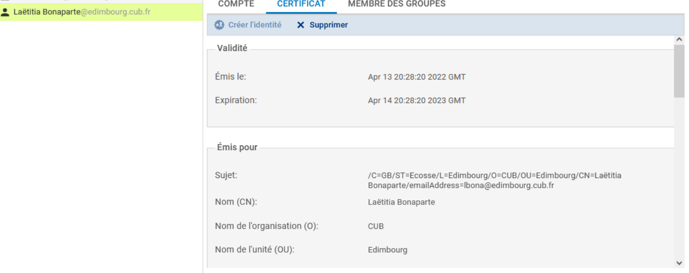

# Fiche 11 -- Infrastructures à clés pubiques (PKI)

## Gestion des certificats

Les pare-feu Stormshield intègrent les fonctions permettant la gestion
des certificats.

### Écran de gestion

-   Se rendre au menu **CONFIGURATION / OBJETS / Certificats et PKI**


**+Ajouter **lance des assistants de configuration permettant d'ajouter
des éléments dans les objets :

-   **Autorité racine :** permet de créer une autorité de certification
    racine gérée par le firewall. Cette autorité peut être une
    sous-autorité d'une PKI externe.
-   **Sous-autorité** :permet de créer une autorité de certification
    dépendant d'une autre CA. L'autorité parente doit être gérée par le
    boitier.
-   **Identité *****utilisateur** *: permet de créer une identité
    *utilisateur* dépendant d'une autorité de certification gérée par le
    boitier.
-   I**dentité *****serveur** *: permet de créer une identité *serveur
    *dépendant d'une autorité de certification gérée par le boitier.
-   **Smartcard** : permet de créer une identité Smartcard dépendant
    d'une autorité de certification gérée par le boitier.
-   **Importer un fichier** : le fichier importé peut être une identité,
    un certificat, une CRL.

### CA interne et externe

#### CA interne

Cette fonctionnalité de gestion d'une infrastructure à clés publiques
permet de répondre à un grand nombre de cas d'usage :

-   **Le pare-feu agit en tant qu'autorité de certification racine (root
    CA) :** le boîtier SNS permet de définir les chaînes de confiance
    nécessaires à une authentification par certificat. Des autorités par
    défaut sont disponibles pour signer les certificats utilisés par le
    proxy SSL ou livrer les certificats nécessaires au fonctionnement du
    VPN SSL. Son certificat d'autorité est auto-signé.

    Les fonctions proposées par le boîtier SNS permettent de répondre
    pleinement au rôle d'autorité de certification (création de
    certificat de différentes natures, signature de CSR, révocation de
    certificat et gestion de CRL).

-   **Le pare-feu agit en tant que sous-autorité de certification :** il
    est possible de définir un boîtier SNS comme étant une sous-autorité
    de certification d'une CA parente (gérée obligatoirement sur le même
    boîtier). Le certificat de la sous-autorité est signé par l'autorité
    parente (pas nécessairement une autorité racine), laquelle est une
    autorité interne ou externe. Cela permet d'organiser plus finement
    la répartition et la distribution des identités, par usages ou par
    entités d'une même entreprise.


#### CA externe

Dans le cadre d'usage d'une CA externe, les fonctionnalités proposées
permettent essentiellement d'importer des certificats et de définir les
relations de confiance pour divers usages :

-   Import de certificats d'autorité de certification.
-   Import de certificats d'équipements.
-   Import de certificats et de clés privés d'équipements (fichiers
    « .p12 » protégés ou pas par mot de passe).

Le firewall agit en tant que PKI en permettant l'import de certificats,
voire d'identités (protégées par des fichiers de type PKCS#12), émis par
une CA externe

Les certificats importés sont accessibles aux modules requérant une
authentification par certificats (interface d'administration, VPN SSL,
VPN Ipsec, etc.)

### Création d'une autorité de certification

-   Se rendre au menu **CONFIGURATION / OBJETS / Certificats et PKI**
   
-    Cliquer sur **Ajouter **puis sélectionner
    **Autorité racine**.
-   Renseigner un **CN** (obligatoire) : il s\'agit d\'un nom permettant
    d'identifier votre autorité racine, dans la limite de 64 caractères.
    Ce nom peut faire référence à une organisation, un utilisateur, un
    serveur, une machine, etc.
-   Renseigner un **Identifiant** (facultatif) : vous pouvez ici
    indiquer un raccourci de votre CN, utile pour vos lignes de
    commande.
-   renseigner les attributs de l\'autorité. Ces informations seront
    présentes dans le certificat de l\'autorité ainsi que dans les
    certificats qu\'elle émettra :

    -   **Organisation (O) :** nom de votre société.
    -   **Unité d'organisation (OU) :** \"branche\" de votre société.
    -   **Lieu (L)** : ville dans laquelle est située votre société
    -   **État ou province (ST)** : département géographique de votre
        société.
    -   **Pays (C)** : pays dans laquelle est située votre société

-   Cliquer sur **Suivant**.
-   Saisir le mot de passe destiné à protéger l\'autorité racine et
    confirmez-le. Une jauge indique le degré de robustesse de votre mot
    de passe. Il est recommandé de combiner les lettres minuscules,
    majuscules, les chiffres et les caractères spéciaux.
-   Renseigner votre **E-mail** (facultatif) afin de recevoir un message
    vous confirmant la création de votre autorité.
-   Modifier éventuellement des éléments du certificat :

-   la valeur de la durée de validité (jours) conseillée des certificats
    est de 365 jours (proposée par défaut). Ce champ correspond au
    nombre de jours durant lesquels votre certificat d\'autorité et par
    conséquent votre PKI seront valides. Cette date influe sur tous les
    aspects de votre PKI. En effet, une fois ce certificat expiré, tous
    les certificats utilisateurs le seront également. **Cette valeur qui
    ne doit pas excéder 3650 jours ne sera pas modifiable par la
    suite**.
-   Vous pouvez aussi modifier la Taille de clé (en bits) du certificat.
    *Bien que les clés de grande taille soient plus efficaces, il est
    déconseillé d'utiliser celles-ci avec les équipements d'entrée de
    gamme, pour des raisons de temps de génération.*


-   Cliquez sur **Suivant **puis encore sur** Suivant.**

Un résumé des informations saisies vous est présenté :


-   Cliquer sur **Terminer**.

!!! Success  "Résultat"
    

L'autorité est automatiquement ajoutée à l'arborescence des autorités,
identités et certificats définis sur le firewall.

Un clic sur l'autorité affiche ses informations détaillées dans la
partie droite de l'écran.

-   Définir éventuellement par défaut l'autorité de certification

    

### Création d'une identité *serveur*

Voir « fiche 12 -- Le VPN »


#### Différence entre les certificats PEM et DER

###### Certificat **PEM** (Privacy Enhanced Mail)
- **Encodage** : Le format **PEM** utilise un encodage **Base64**.
- **Structure** : Le contenu est encadré par des balises :

```bash
 -----BEGIN CERTIFICATE-----
 (contenu encodé en Base64)
 -----END CERTIFICATE-----
```

-  **Utilisation :** Principalement utilisé pour les certificats SSL/TLS sur les serveurs web, ainsi que pour stocker des clés privées et des certificats intermédiaires.
-  **Extension de fichier :** Les fichiers PEM ont souvent l'une des extensions suivantes : .pem, .crt, .cer, ou .key.
-  **Lisibilité :** Il est lisible en texte brut et peut être ouvert avec n'importe quel éditeur de texte.

###### Certificat DER (Distinguished Encoding Rules)
-    **Encodage :** Le format DER est binaire (non encodé en Base64).
-    **Structure :** Pas de balises, le fichier est stocké dans un format binaire pur.
-    **Utilisation :** Couramment utilisé dans des environnements où l'encodage Base64 n'est pas nécessaire, comme les applications Java.
-    **Extension de fichier :** Les fichiers DER ont généralement l'extension .der ou .cer.
-    **Lisibilité :** Non lisible en texte brut. Il ne peut pas être ouvert directement avec un éditeur de texte classique.

### Création et gestion d'une identité *utilisateur*

**Première méthode** à partir d'un utilisateur créé dans l'annuaire LDAP
interne du firewall

il est possible de générer une identité *utilisateur* **directement
depuis l'annuaire LDAP interne du firewall**. Dans ce cas, le choix de
l'autorité signataire se porte automatiquement sur la CA désignée par
défaut.

-   Se rendre au menu **CONFIGURATION / UTILISATEURS / Utilisateurs**
-   Sélectionner l'utilisateur puis cliquer sur **CERTIFICAT** puis
    **Créer l'identité**


-   Cliquer sur « Créer l'identité » ⇒ Le certificat de l'utilisateur
    s'affiche



Il est également visible via le menu **OBJETS / CERTIFICATS et PKI**


Deuxième méthode

-   Se rendre au menu **CONFIGURATION / OBJETS / Certificats et PKI**
-   Cliquer sur **+Ajouter **puis Identité Utilisateur.
-   Renseigner :
    1.  un CN (obligatoire) : nom permettant d'identifier l\'utilisateur
        dans la limite de 64 caractères.
    2.  un Identifiant (facultatif) : vous pouvez ici indiquer un raccourci
        de votre CN, utile pour vos lignes de commande (exemple : si le CN
        est un couple Prénom+Nom, l\'identifiant peut correspondre aux
        initiales du CN).
    3.  l'adresse e-mail (obligatoire) de l\'utilisateur pour lequel vous
        créez une identité.
-   Cliquer sur Suivant.
-   Sélectionner l\'Autorité parente destinée à signer le certificat de
    l\'identité.
-   Renseigner le Mot de passe de l\'autorité parente.

!!! Success  "Info"
    Les attributs de l\'autorité sont automatiquement ajoutés. Ils seront
    présents dans le certificat utilisateur.

-   Cliquer sur Suivant.

!!! Info  "Info"
    Lorsque le firewall dispose d'un TPM et que celui-ci a été initialisé,
    cocher la case Protéger cette identité à l'aide du TPM pour enregistrer
    cette identité sur le TPM.

??? Info  "TPM"
    Le TPM (Trusted Platform Module) est un composant matériel de sécurité qui permet de stocker et protéger les clés cryptographiques ainsi que d'autres données sensibles de manière sécurisée. Le TPM est conçu pour renforcer la sécurité des systèmes en fournissant des fonctionnalités comme l'authentification sécurisée et le chiffrement des données. Il est obligatoire pour Windows 11 désormais en version 2.0 (Puce TPM)

-   Modifier éventuellement des éléments du certificat : la valeur de la
    durée de validité (jours) conseillée des certificats est de 365
    jours (proposée par défaut). Vous pouvez aussi modifier la Taille de
    clé (en bits) du certificat. *Bien que les clés de grande taille
    soient plus efficaces, il est déconseillé d'utiliser celles-ci avec
    les équipements d'entrée de gamme, pour des raisons de temps de
    génération.*

!!! Warning  "Attention"
    Si **l\'autorité utilisée pour générer le certificat est l'autorité par
    défaut** du firewall ET si **un utilisateur déclaré dans l'annuaire
    LDAP référence la même adresse e-mail** que celle précisée à l'étape 3,
    vous pouvez associer automatiquement cette identité à l'utilisateur
    correspondant :

-   Cocher la case **Publier cette identité dans l'annuaire LDAP**,
-   Saisissez deux fois un mot de passe destiné à protéger le conteneur
    PKCS#12 de l'identité.
-   Cliquer sur Suivant ⇒ Un résumé des informations saisies vous est
    présenté.
-   Cliquer sur Terminer.

!!! Success  "Info"
    L'identité est automatiquement ajoutée à l'arborescence des autorités,
    identités et certificats définis sur le firewall, sous son autorité
    parente.

### Gestion des identités et certificats

Menu Télécharger

**Certificat** : le format d'export contient des données en base64
(.pem) ou des données binaires (.der). Le fichier exporté contient le
certificat du porteur mais également les certificats des autorités
présentes dans la chaîne de confiance de ce certificat.

**Identité** : l'identité, puisqu'elle contient une clé privée, est
sensible et son export doit être protégé par un mot de passe, lequel
permet de chiffrer la clé privée qu'il contient. L'identité est pour
rappel constituée de la clé privée du porteur, de son certificat (qui
contient sa clé publique), et des certificats de la chaîne de confiance.
Le fichier d'export est un container .pem ou un container PKCS#12 (ou
.p12).

## Document 1 : Rappels et vocabulaire

??? Info  "Infrastructure à clés publiques ou PKI (Public Key Infrastructure)"
    Infrastructure qui héberge les informations publiques (annuaire, CRL) et
    qui permet d'accéder aux certificats de l'organisation, d'effectuer un
    renouvellement de certificat, ou de le révoquer.

Un certificat peut contenir du texte (extensions .pem, .crt) ou des
données binaires directement (extensions .cer, .der).

La validité du certificat est remise en cause :

-   à l'expiration de ce dernier (limitation dans le temps) ;
-   à l'expiration de la CA ;
-   en cas de perte ou de vol de la clé privée du propriétaire ;
-   en cas de départ du propriétaire de la société.


!!! Info "Liste des certificats révoqués"
    La **CRL** est un fichier signé par la CA, qui liste les numéros de série
    des certificats révoqués avant leur expiration. Cette liste doit être
    accessible publiquement pour permettre aux utilisateurs de s'assurer que
    les identités qui leur sont présentées sont encore valides.


!!! Info "Stockage des identités numériques par la CA"
    Lorsque la CA génère les bi-clés, il est simple de contrôler la
    robustesse des clés et de les sauvegarder, mais cela nécessite la mise
    en place d'une procédure sécurisée pour délivrer son identité à un
    utilisateur final. Il existe pour cela un container protégé standardisé
    nommé PKCS#12 qui contient traditionnellement : \[clé privée du
    porteur + certificat du porteur (contenant sa clé publique) + certificat
    de la CA signataire\].

## Document 2 : Fonctionnalités de la PKI de Stormshield

### Authentification d'utilisateurs

1\. L'utilisateur mobile, ou l'administrateur de l'interface web,
souhaitant s'authentifier auprès du firewall présente son certificat
utilisateur, soit par son navigateur web, soit par son client VPN IPsec,

2\. Le firewall vérifie la validité du certificat et contrôle l'identité
de l'utilisateur sur le serveur LDAP,

3\. Les politiques d'accès attachées à cet utilisateur peuvent alors lui
être appliquées, pour permettre l'accès aux ressources réseau internes.

### Authentification de serveurs (et / ou de clients)

1. Le serveur, lors de l'initialisation d'une session, présente son
certificat serveur au client, lequel vérifie sa validité,

2. Éventuellement, le client présente son certificat client au serveur,
lequel vérifie sa validité. Lorsque cette étape est présente, il s'agit
d'une session avec authentification mutuelle (c'est le cas par exemple
d'une session TCP/TLS entre le firewall client et le serveur Syslog
Stormshield Visibility Center),

3. Après l'authentification, le client et le serveur négocient une clé
de session.

### Authentification de passerelles IPSec

1. Lors de la phase d'établissement du tunnel, le firewall qui initie
le tunnel (Initiator) présente son certificat à la passerelle distante,
laquelle vérifie sa validité,

2. Le firewall qui répond (Responder) présente son certificat à la
passerelle distante, laquelle vérifie sa validité,

3. Outre les vérifications effectuées sur la validité des certificats
présentés (intégrité, signature numérique, période de validité, etc.),
le certificat de l'autorité de certification ayant signé le certificat
de la passerelle distante doit appartenir au groupe de confiance de CA,
'est-à-dire aux autorités de certification acceptées dans la politique VPN Ipsec,

4. La vérification de l'identité de la passerelle distante permet de
garantir que le tunnel est monté avec la passerelle identifiée par le
certificat, ce point optionnel ne peut être défini qu'en CLI.
